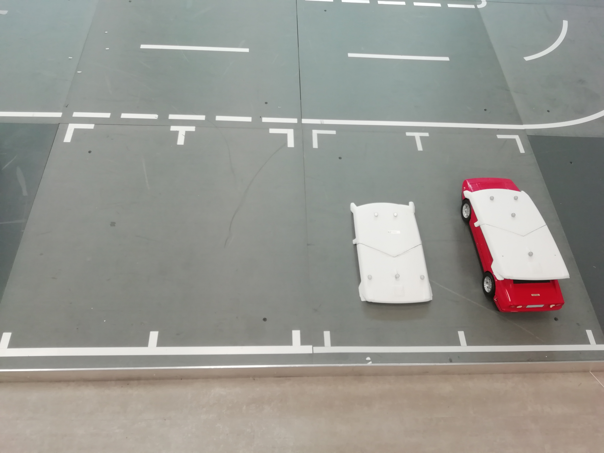

## Testcase: Booking an Available Parking Spot (ST_001)

### Preparation:
1. Launch the 'Spotfinder' Launch file.
    1. Ensure the launch file does not have an error.
    2. Ensure all the Software components are started.
2. Ensure the parking spots are loaded from the JSON file and are available.
3. The system is connected and receiving RigidBodies messages that represent vehicle positions.
4. Two parking spot are free ( spot id 0 and 1) and other  two are occupeid.
5. Optitrack System should be running.
6. Set monitor to get image output in rqt.

### Test execution:
1. Get a request from path planning node to book a parking spot that is available (i.e., not occupied or already booked).
2. Check the response to verify that the booking service.

### Expected result:
1. The response indicates that the booking is successful in path planning.

### Observations:
1. Confirm if the response was received in a timely manner (60 seconds).
2. Path planning shows parking spot is booked.

### Test results:
The Oberservations match with the expected results.
Select one optioin and press conform button.

## Testcase: Booking a Parking Spot with a Timeout (ST_002)

### Preparation:
1. Launch the 'Spotfinder' Launch file.
    1. Ensure the launch file does not have an error.
    2. Ensure all the Software components are started.
2. Ensure the parking spots are loaded from the JSON file and are available.
3. The system is connected and receiving RigidBodies messages that represent vehicle positions.
4. Two parking spot are free ( spot id 0 and 1) and other  two are occupeid.
5. Optitrack System should be running.
6. Set monitor to get image output in rqt.

### Test execution:
1. Send a request from path planning node to book a parking spot that is available (i.e., not occupied or already booked).
2. Wait until the booking timeout period is about to expire.
3. Check the response from the booking service.

### Expected result:
1. The response indicates that the booking is successful in path planning.
2. Book one Parking spot.

### Observations:
1. Confirm if the spot booked after the timeout period.
2. Path planing shows parking spot is booked.

### Test results:
The Oberservations match with the expected results.
After time out system select one option.

