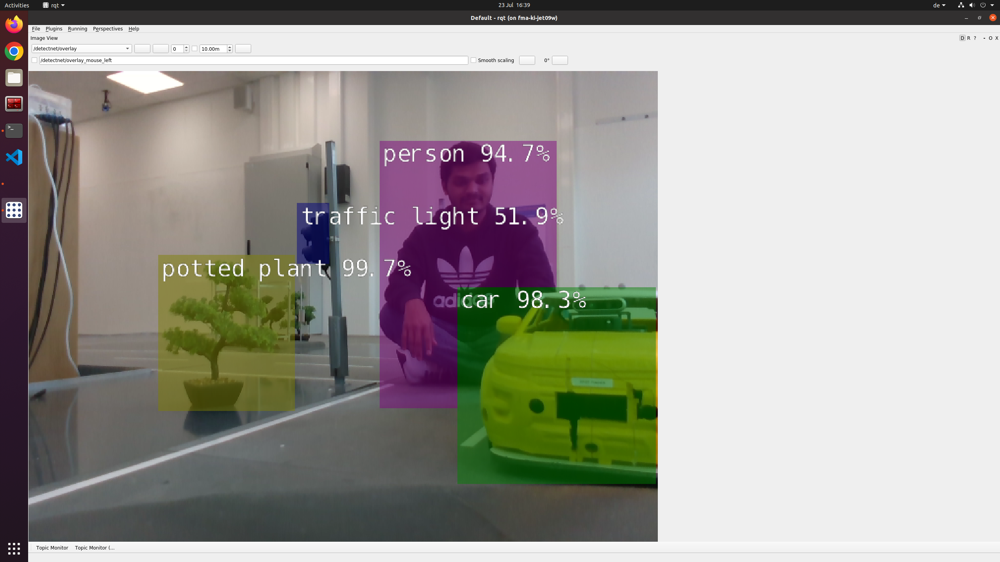
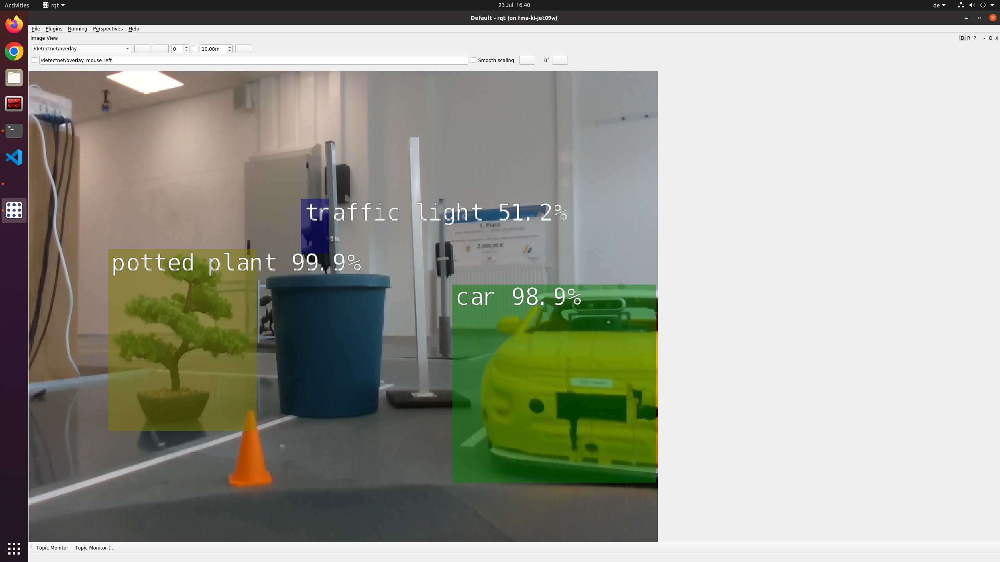

`Author: Suraj Yadav`

## Testcase: To detect the relevant object (ST_001)

### Preparation:
Preparation:
1. Set up the vehicle in a controlled environment.

    I. Launch the 'Spotfinder' Launch file.

    II. Ensure the launch file does not have an error.   

    III. Ensure optitrack is running.       

    IV. Ensure to start all software component

          a. realsense camera node
    
          b. detectnet
    
          c. sf_env env_model  
    V. Place relevant objects (e.g., person, car, potted plant, traffic light) at various distances and positions around the vehicle and keep vehicle in model city.
2. Set monitor to get image output in rqt.

### Test execution:
1. Start the vehicle's object detection system.
2. Move the vehicle within the environment to different positions to test detection from various angles and distances.

### Expected result:
1. The realsense camera in vehicle should detect all relevant objects within its environment.
2. The detected objects should be accurately identified and their positions correctly logged.

### Observations:
1. Record which objects were detected by the vehicle.
2. Record the accuracy of the detection (e.g., how many objects were correctly identified)

### Test results:
The Oberservations match with the expected results

## Testcase: To ignore the irrelevant object (ST_002)

### Preparation:
Preparation:
1. Set up the vehicle in a controlled environment.

    I. Launch the 'Spotfinder' Launch file.

    II. Ensure the launch file does not have an error.   

    III. Ensure optitrack is running.       

    IV. Ensure to start all software component

          a. realsense camera node
    
          b. detectnet
    
          c. sf_env env_model  
    V. Place relevant objects (e.g., person, car, potted plant, traffic light) at various distances and positions around the vehicle and keep vehicle in model city.
2. Set monitor to get image output in rqt.

### Test execution:
1. Start the vehicle's object detection system.
2. Move the vehicle within the environment to different positions to test detection accuracy and relevance filtering.

### Expected result:
1. The realsense camera in vehicle should detect only the relevant objects within its environment.
2. The irrelevant objects should be ignored by the detection system.

### Observations:
1. Record which objects were detected by the vehicle.
2. The irrelevant objects are ignored by the detection system.

### Test results:
The Oberservations match with the expected results

