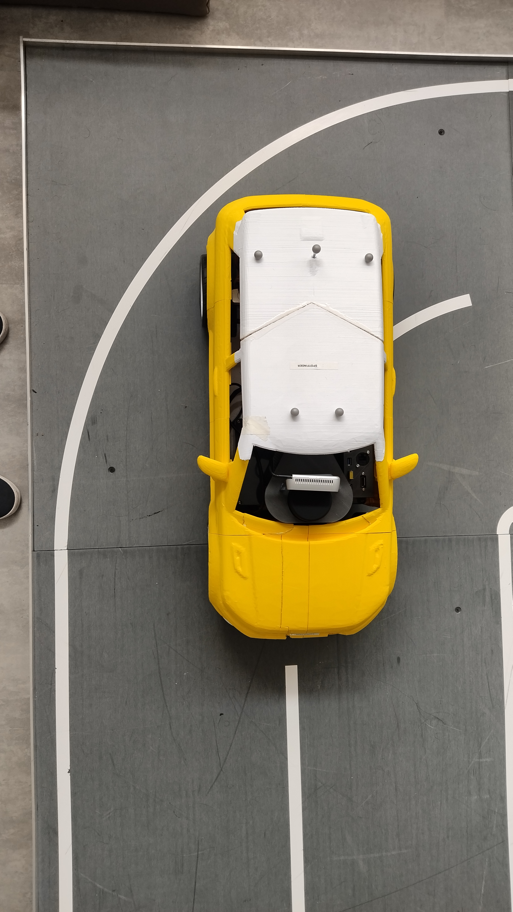
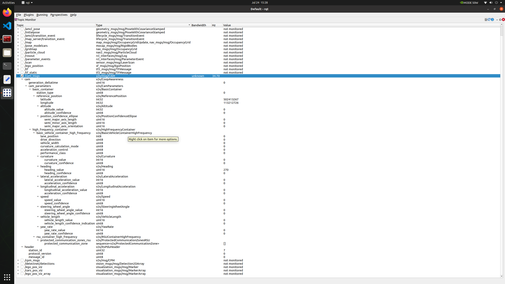
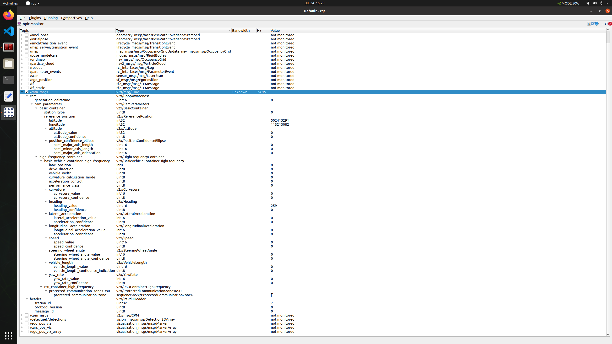
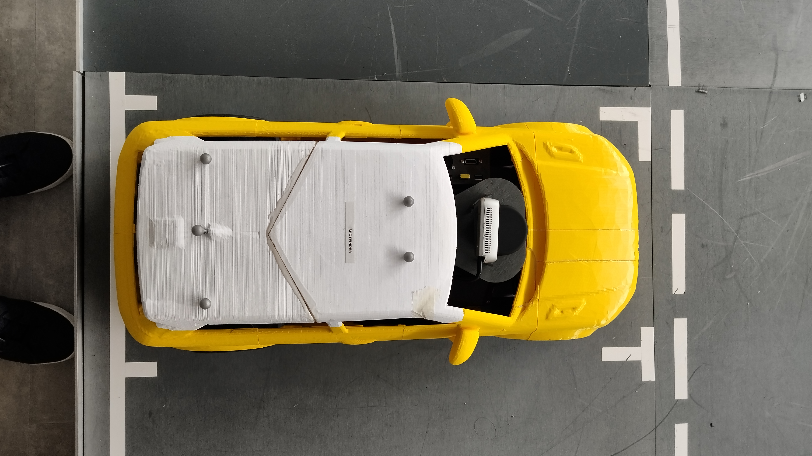

## Testcase: ST_001_UR005

### Preparation:
1. All the components of the system are launched and running

### Test execution:
1. The model car is placed such that the rear axel of the vehicle should align with the mid line of the first block (50 cm from origin) and the vehicle should face along the x axis of the model city and the centre of the rear axel should be 50cm from the x axis of model city. 

### Expected result:
1. The system publishes the latitude, longitude (WGS84) and yaw (ETSI) of the vehicle in the /cam_msgs topic

### Observations:
1. The vehicle's latitude, longitude and yaw can be seen in the /cam_msgs topic as can be seen in the image below.

### Test results:
Passed

## Testcase: ST_002_UR005

### Preparation:
1. All the components of the system are launched and running

### Test execution:
1. The system drives the model car along the generated path to reach the user selected parking spot (Here, spot id = 0)

### Expected result:
1. The system publishes the latitude, longitude (WGS84) and yaw (ETSI) of the vehicle in the /cam_msgs topic while driving along the generated path

### Observations:
1. The system publishes the latitude, longitude and yaw at a rate of 35 hz when the system is driving towards the parking spot. The following image shows the change for one instance in driving.

### Test results:
Passed

## Testcase: ST_003_UR005

### Preparation:
1. All the components of the system are launched and running

### Test execution:
1.  The system drives the model car along the generated path to reach the user selected parking spot (Here, spot id = 0)
2. The model car is stationary at the final position.

### Expected result:
1. The system publishes the latitude, longitude (WGS84) and yaw (ETSI) of the vehicle in the parking spot in the /cam_msgs topic

### Observations:
1. The vehicle's latitude, longitude and yaw can be seen in the /cam_msgs topic as can be seen in the image below.

### Test results:
Passed

