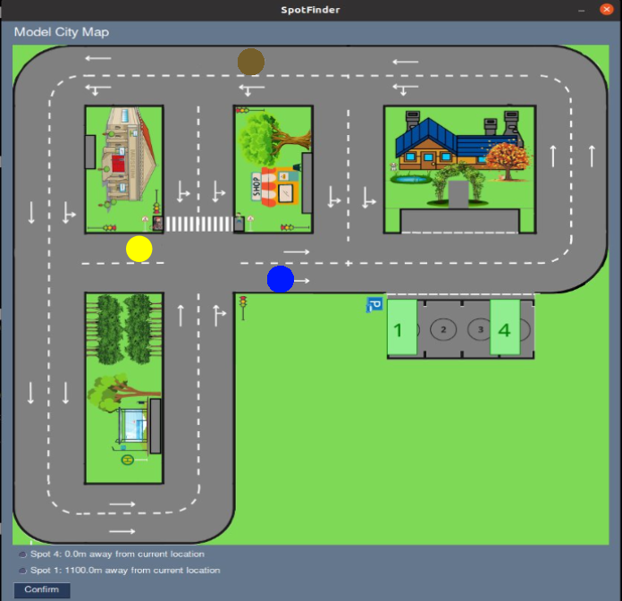

# Title Test Case 1: Verify Communication Establishment

## Preparation:
1.	Ensure all vehicles (including the Test Vehicle) in the test environment are equipped with a compatible communication system.
2.	Verify that a opti track is operational to facilitate communication and data exchange between vehicles.

## Test Execution:
1.	The Test Vehicle initiates communication with all other vehicles in the environment.
2.	Monitor and confirm the successful establishment of communication links with each vehicle.

## Expected Result:
1.	The Test Vehicle establishes a successful communication link with all other vehicles.

# Title Test Case 2: Verify Data Reception

## Preparation:
1.	Ensure the Test Vehicle and all other vehicles are active and their communication systems are operational.
2.	Confirm that positional data transmission is enabled on all vehicles.

## Test Execution:
1.	The Test Vehicle receives positional data (pose and position) from all other vehicles in real-time.
2.	Observe the data reception process to ensure that all incoming data is recorded.

## Expected Result:
1.	The Test Vehicle receives accurate and complete positional data from all other vehicles.

# Title Test Case 3: Verify Data Processing and Display

## Preparation:
1.	Ensure the interface/map of the Test Vehicle is operational and correctly configured to display positional data.
2.	Confirm that the Test Vehicle is receiving live positional data from all other vehicles.

## Test Execution:
1.	The Test Vehicle processes the received positional data and updates its on map.
2.	Observe the map to confirm it reflects the current positions of all other vehicles accurately.

## Expected Result:
1.	The Test Vehicle displays the positions of all other vehicles accurately and in real-time on map.

Yellow is our car and the other two vehicles (Brown circle and Blue circle) are display on map.