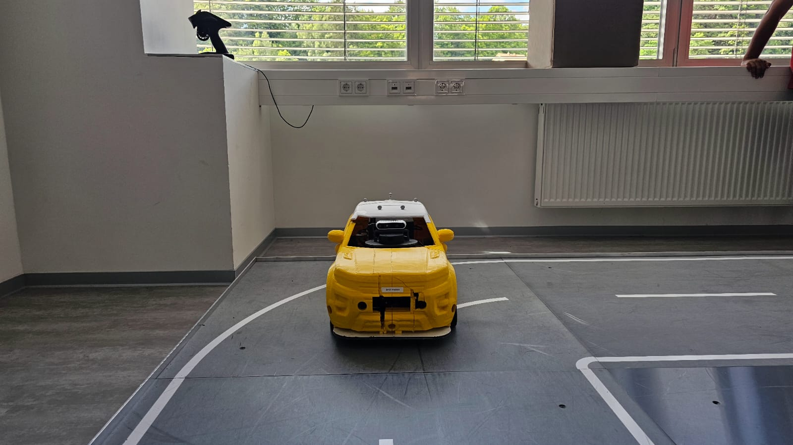
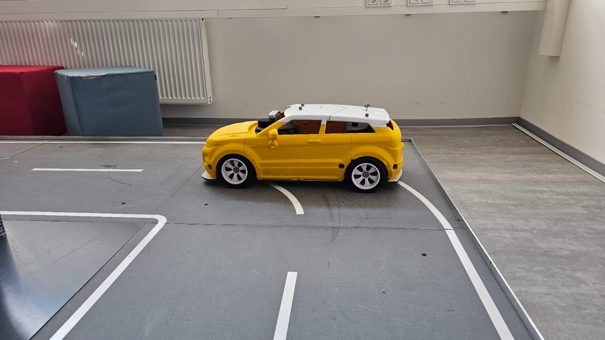
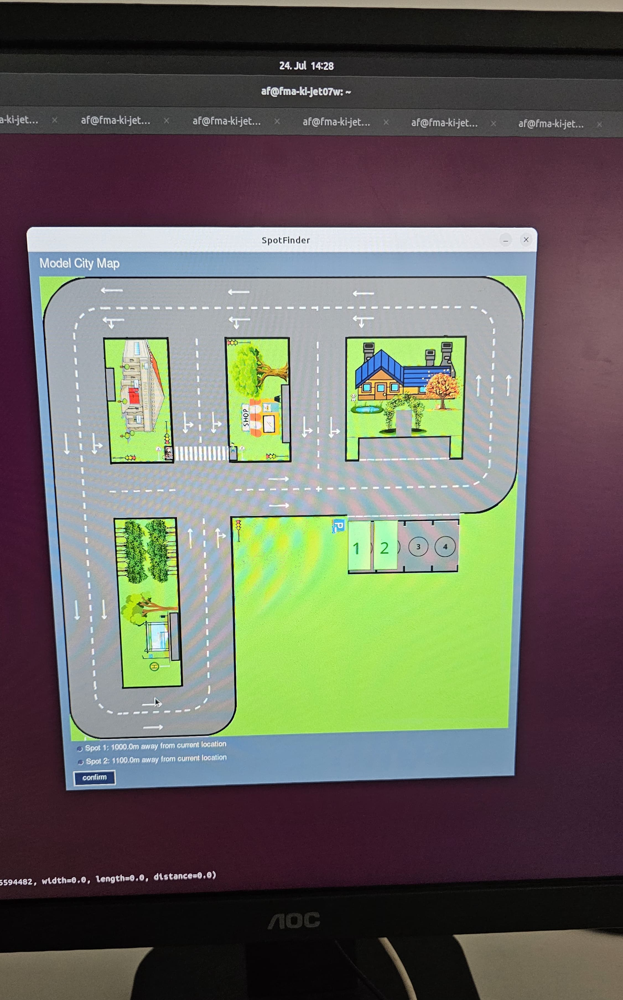
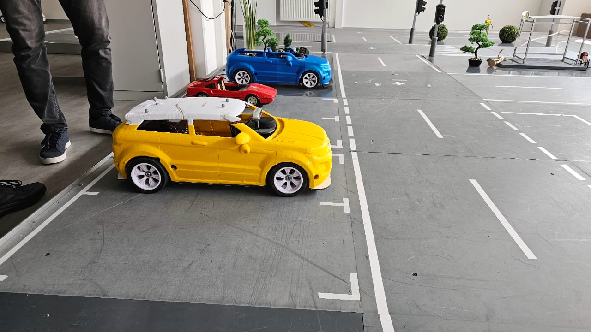
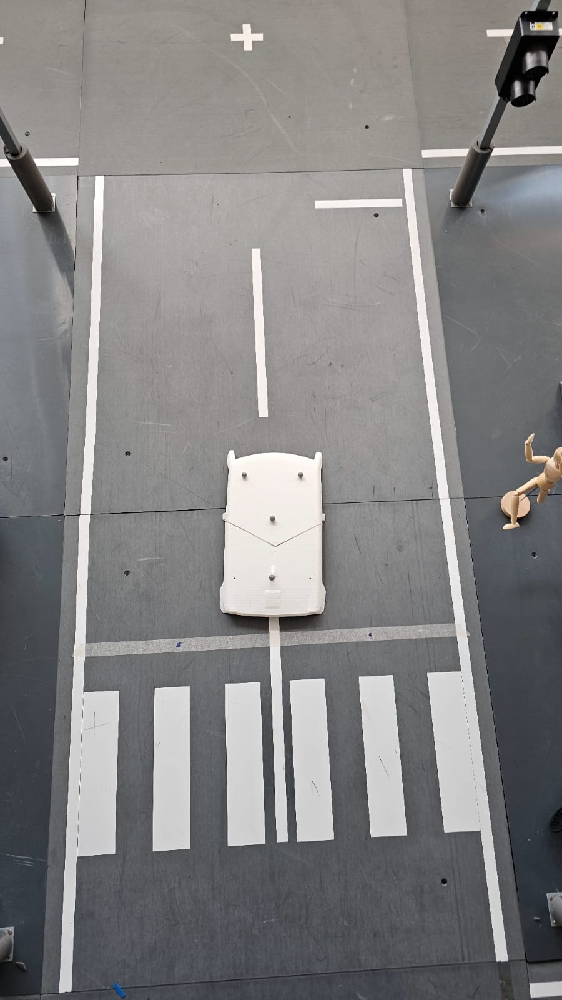

`Author: Sandip Vasoya`

## Test Case 1: 
**Test Case ID:** ST_001_UR_009
**Test Case Title:** `Successful Navigation to Selected Parking Spot`  
**Test Objective:** Verify that the vehicle can navigate from the start location to the selected parking spot without any issues.

**Preparation:**
- The vehicle is at the start location at the top left corner, at the beginning of street "J." as per fig.1
- The car is facing the "x-axis."
- Launch the 'Spotfinder' Launch file.
- Ensure the launch file does not have an error.   
- Ensure all the Software components are started. 
- Ensure the controller switch is "ON."
- Ensure there is no traffic on this route.
- Parking spot (Spot 1) is selected and available.

**Test execution:**
1. Start the vehicle.
2. Check that all the above nodes are working properly.
3. Select parking spot 1 on the User Interface of Spotfinder.
4. Monitor the vehicle driving to parking spot 1.

**Expected Result:**
- The vehicle successfully navigates from the start location to parking spot 1 without any issues.
- All nodes function correctly throughout the process.
- The vehicle parks within the boundaries of parking spot 1.

**Observations:**
- The vehicle reaches parking spot 1.
- The vehicle parks within the boundaries of the spot.

**Test results:** 
Test is PASS , The Oberservations match with the expected results

**Fig.1** 

**Test result : 1**

---

## Test Case 2: 
**Test Case ID:** ST_002_UR_009   
**Test Case Title:** `Navigation to Parking Spot which is nearest from staring position.` \
**Test Objective:** Verify that the vehicle can navigate to the nearest parking spot.

**Preparation:**
- The vehicle is at the start location at the top left corner, at the beginning of street "J." as per fig.1
- The car is facing the "x-axis."
- Launch the 'Spotfinder' Launch file.
- Ensure the launch file does not have an error.   
- Ensure all the Software components are started. 
- Ensure the controller switch is "ON."
- Ensure some vehicles are parked at parking spot 1.
- Parking spot (Spot 2) is selected and available.

**Test execution:**
1. Start the vehicle.
2. Check that all the above nodes are working properly.
3. Select nearest parking spot  on the User Interface of Spotfinder.
4. Monitor the vehicle driving to parking spot 2.

**Expected Result:**
- The vehicle successfully navigates from the start location to parking spot 2, adjusting the route to avoid traffic.
- All nodes function correctly throughout the process.
- The vehicle parks within the boundaries of parking spot 2.

**Observations:**
- The vehicle reaches parking spot 2.
- The vehicle parks within the boundaries of the spot.

**Test Results:** 

Test is PASS , The Oberservations match with the expected results

**Test result : 2**

---

## Test Case 3: 
**Test Case ID:** ST_003_UR_009  
**Test Case Title:** `Navigation from Different Starting Positions ` 
**Test Objective:** Verify that the vehicle can navigate to the selected parking spot from different starting positions.

**Preparation:**
- The vehicle is at the start location at the top right corner, at the beginning of street "G." as per Fig.2 
- The car is facing the "y-axis."
- Launch the 'Spotfinder' Launch file.
- Ensure the launch file does not have an error.   
- Ensure all the Software components are started. 
- Ensure the controller switch is "ON."
- Ensure there is no traffic on this route.
- Parking spot (Spot 1) is selected and available.

**Test execution:**
1. Start the vehicle.
2. Check that all the above nodes are working properly.
3. Select parking spot 1 on the User Interface of Spotfinder.
4. Monitor the vehicle driving to parking spot 1.

**Expected Result:**
- The vehicle successfully navigates from different starting positions as per fig 3  to parking spot 1.
- All nodes function correctly throughout the process.
- The vehicle parks within the boundaries of parking spot 1 .

**Observations:**
- The vehicle reaches parking spot 1.
- The vehicle parks within the boundaries of the spot.

**Test results:** 
Test is PASS , The Oberservations match with the expected results

**Fig.2** 

**Test result : 3**

---

## Test Case 4: 
**Test Case ID:** ST_004_UR_009  
**Test Case Title:** `Selection of Different Parking Spots`  
**Test Objective:** Verify that the vehicle can navigate to different selected parking spots.

**Preparation:**
- The vehicle is at the start location at the top left corner, at the beginning of street "J."
- The car is facing the "x-axis."
- Launch the 'Spotfinder' Launch file.
- Ensure the launch file does not have an error.   
- Ensure all the Software components are started. 
- Ensure the controller switch is "ON."
- Ensure there is no traffic on this route.
- Parking spot (Spot 3) is selected and available.

**Test execution:**
1. Start the vehicle.
2. Check that all the above nodes are working properly.
3. Select parking spot 3 on the User Interface of Spotfinder.
4. Monitor the vehicle driving to parking spot 3.

**Expected Result:**
- The vehicle successfully navigates to different selected parking spots.
- All nodes function correctly throughout the process.
- The vehicle parks within the boundaries of the selected parking spot 3.

**Observations:**
- The vehicle reaches parking spot 3.
- The vehicle parks within the boundaries of the spot.

**Test results:** 
Test is PASS , The Oberservations match with the expected results

**Fig.3** 

**Test result : 4**

---

## Test Case 5: 
**Test Case ID:** ST_005_UR_009   
**Test Case Title:** `Dynamic Route Change Due to Traffic`  
**Test Objective:** Verify that the vehicle dynamically changes its route to avoid traffic and still reaches the selected parking spot.

**Preparation:**
- The vehicle is at the start location at the top left corner, at the beginning of street "G."
- The car is facing the "Y-axis."
- Launch the 'Spotfinder' Launch file.
- Ensure the launch file does not have an error.   
- Ensure all the Software components are started. 
- Ensure the controller switch is "ON."
- Ensure no cars are parked at parking spot 1.
- Ensure there is some traffic between streets "H" and "E" as per Fig.4
- Parking spot (Spot 1) is selected and available.

**Test execution:**
1. Start the vehicle.
2. Check that all the above nodes are working properly.
3. Select parking spot 1 on the User Interface of Spotfinder.
4. Monitor the vehicle driving to parking spot 1.

**Expected Result:**
- The vehicle successfully navigates around traffic , change the route and reaches the selected parking spot.
- All nodes function correctly throughout the process.
- The vehicle parks within the boundaries of parking spot 1.

**Observations:**
- The vehicle selects another route to reach the parking spot.
- The vehicle reaches parking spot 1.
- The vehicle parks within the boundaries of the spot.

**Test results:** 
Test is PASS , The Oberservations match with the expected results

**Fig.4** 

**Test result : 5**

**Test result : Video**
- Your browser does not support the video tag. go into [here](resources\System_test_image\location2.1.mp4)

---

## Test Case 6: 
**Test Case ID:** ST_006_UR_009 
**Test Case Title:** `Emergency Braking During Navigation`
**Test Objective:** Verify that the vehicle can perform an emergency brake when an obstacle suddenly appears in its path.

**Preparation:**
- The vehicle is at the start location at the top left corner, at the beginning of street "J."
- The car is facing the "x-axis." as per Fig.1
- Launch the 'Spotfinder' Launch file.
- Ensure the launch file does not have an error.   
- Ensure all the Software components are started. 
- Ensure the controller switch is "ON."
- Ensure some objects are in front of the vehicle.
- Parking spot (Spot 1) is selected and available.

**Test execution:**
1. Start the vehicle.
2. Check if the lidar is working.
3. Check that all the above nodes are working properly.
4. Select parking spot 1 on the User Interface of Spotfinder.
5. Monitor the vehicle driving to parking spot 1.

**Expected Result:**
- The vehicle performs an emergency brake when an obstacle appears.
- The vehicle resumes navigation once the obstacle is cleared.
- All nodes function correctly throughout the process.
- The vehicle parks within the boundaries of parking spot 1.

**Observations:**
- The vehicle stops when objects are in front of it and accelerates after the objects are removed.
- The vehicle reaches parking spot 1.
- The vehicle parks within the boundaries of the spot.

**Test results:** 
Test is PASS , The Oberservations match with the expected results

**Test result : 6**

**Test result : Video**
- Your browser does not support the video tag. go into [here](resources\System_test_image\traffic_1.mp4)
