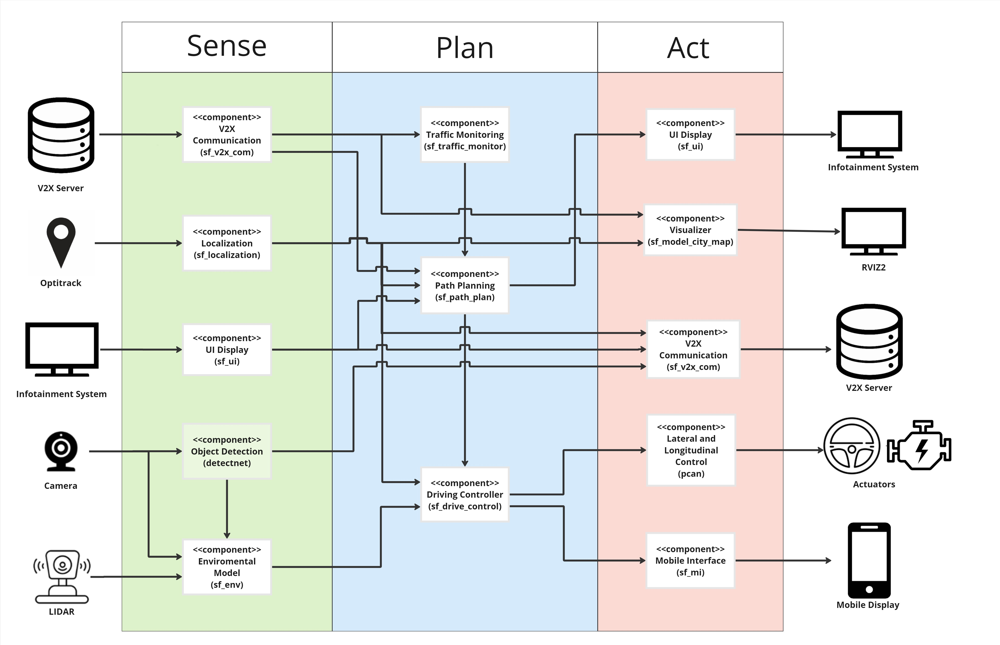
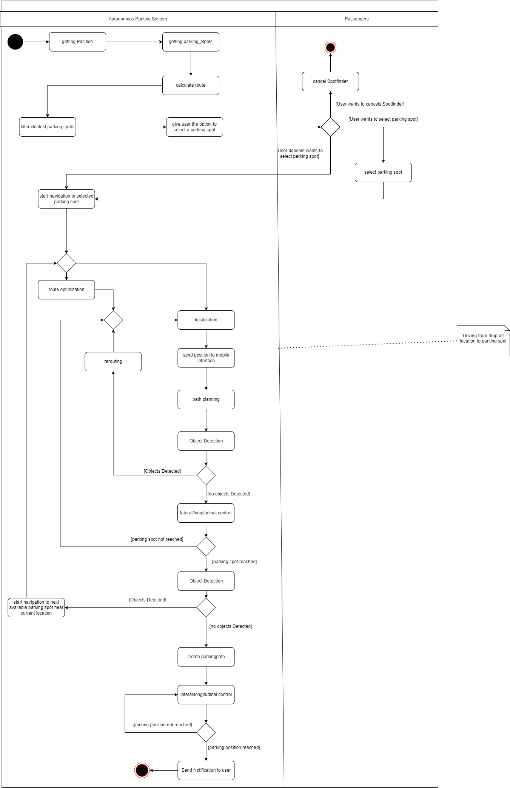
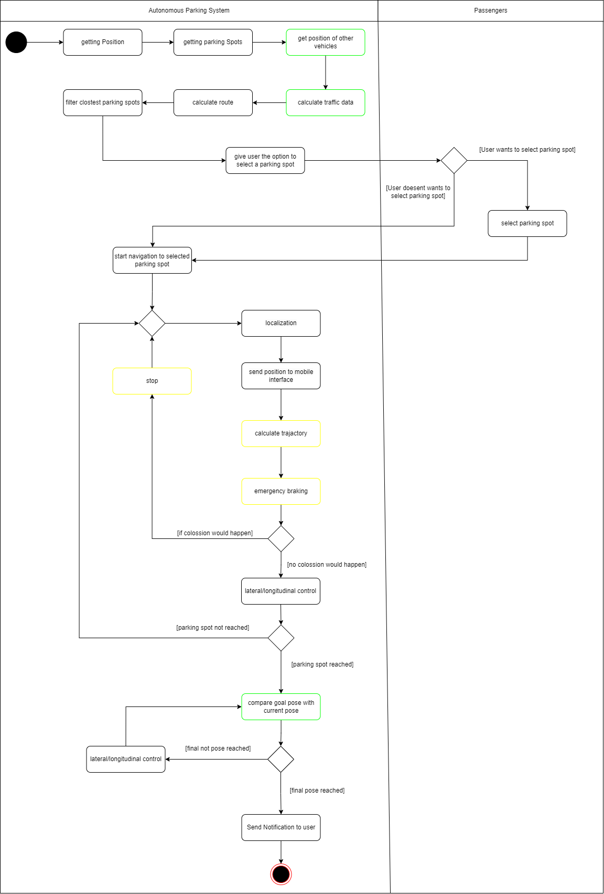

### This document contains the bock diagram, activity diagram and state diagram of the SpotFinder

# Table of Conent

1. [Block-Diagram](#component-diagram)
2. [Activity-Diagram](#activity-diagram)
3. [State-Diagram](#state-diagram)

# Block-Diagram

# Activity-Diagram
### Activity-Diagram Module 5

### Activity-Diagram Module 6
 

 

Boxes with a green border are new compared to the architecture of M5 and boxes with a yellow border have been renamed.

### Description

The activity diagram describes the general program flow. Two actors, the autonomous parking system and the passengers, are taking actions in the activity diagram. The activity diagram can be divided into three parts. The first part is the selection of the parking spot, the second one is driving to the parking spot, and the last part is the parking process. The precondition and entry point to the activity diagram is that the ego vehicle has reached the drop-off location of the passengers, and the passengers are still in the vehicle.

The first part of the activity diagram describes the parking spot selection process. The vehicle requests available parking spots and the positions of other road users from the V2X Server. In the next step, the route to all parking spots will be calculated while considering the current traffic density. The closest two parking spots will be presented to the passengers via the infotainment system of the vehicle. If the passengers select a parking spot and leave the vehicle, the autonomous parking system will start the navigation to the selected parking spot. If no parking spot is selected, the system will automatically select the closest parking spot and start the navigation as soon as the passengers have left the vehicle.

The second part describes the driving process to the parking spot. During the driving process, the system is constantly monitoring the environment. If an obstacle is detected in front that would result in a collision, the vehicle stops immediately and waits until the path is free again. The driving process ends when the vehicle reaches the parking spot. During the driving process, the position of the vehicle is sent to the mobile interface to inform the user about the position of their vehicle.

After reaching the destination, the parking maneuver will start. During the parking process, the current pose is compared with the goal pose, and as soon as the goal pose is reached, the parking process is finished. When the parking process is complete, the user will get a notification that their vehicle has reached the parking position.

# State-Diagram
### State-Diagram Module 5

### State-Diagram Module 6

  

The state diagrams from module 5 and module 6 are added for making evident the changes.

### Description

The state diagram represents the transition between the various states of the SpotFinder system. When the vehicle reaches the drop-off location, the vehicle goes to `Retrieving Parking Spots` state where it receives the list of all the available parking spots and the vehicle is stationary during this state. This is also the initial state of the system. Then only if any spot is available the system will transition to the `Selection of Parking Spot` state where the cost of routes to the parking spot is calculated and the spot options are provided to the user for selection. The system will then move on to the `Driving` state if the user selects a spot or if there is a timeout for selecting the spot. The vehicle then drives towards the selected spot using the generated route. And once the vehicle reaches the last waypoint in the generated route, the system changes to the `Parking` state. In the parking state the system will execute the parking manoeuvre until the vehicle is parked. During the `Driving` and `Parking` state if the system detects any obstacles on the path the vehicle goes into `Emergency Stop` state where the vehicle just stops in front of the obstacle. After the parking manoeuvre is completed the system goes to the final state, which is, `Stand-by` where it notifies the user about the successful parking. 

