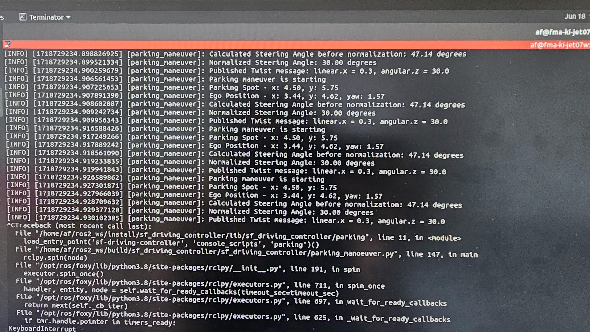
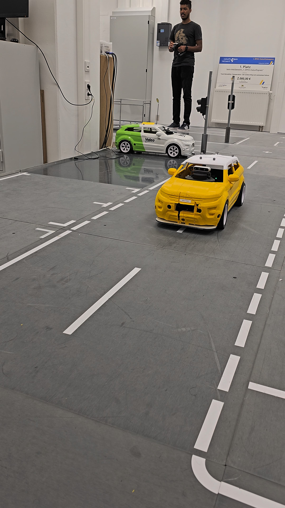
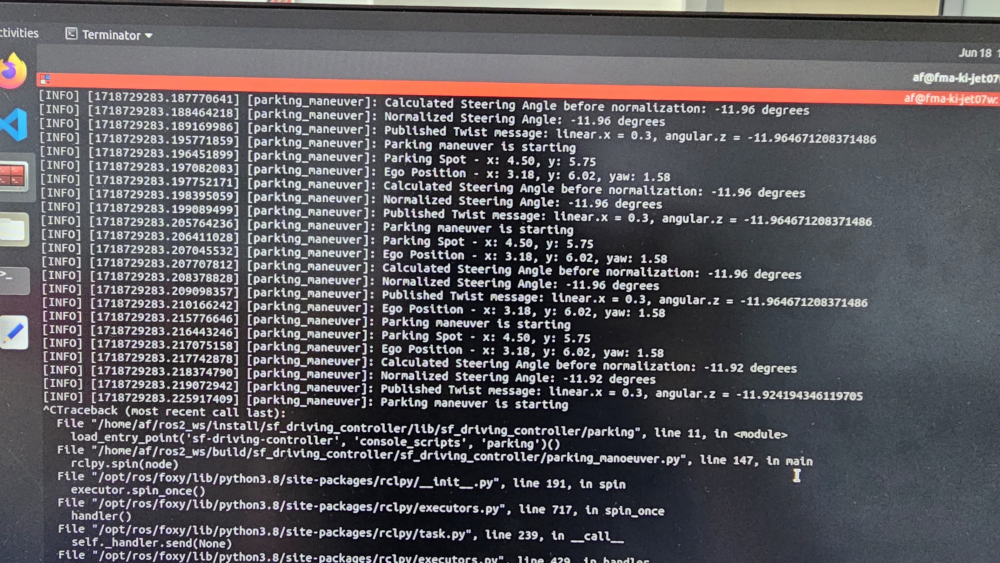
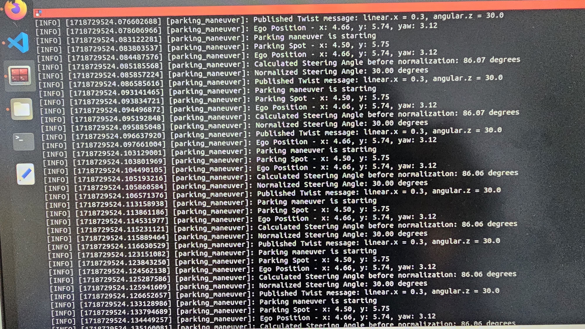

# Parking Maneuver Node Integration Tests(IT_DC)

## Overview
This document outlines the integration tests for the `ParkingManeuverNode` in the ROS2-based autonomous vehicle parking system. The tests validate the behavior of the node with ego position data. The tests ensure that the vehicle aligns with a parking spot, moves forward or backward as needed, and completes the parking maneuver successfully.

## Precondition
- The `parking_maneuver` node is running.
- The `ros2pcan` node is running.
- The `ego_position` publisher is set up to simulate the position data.

## Integration Tests

### Test 1: Alignment and Forward Movement(IT_DC_001)
| **Precondition**                                            | **Test Steps**                                                                                               | **Expected Results**                                                                                                                           |
|-------------------------------------------------------------|--------------------------------------------------------------------------------------------------------------|------------------------------------------------------------------------------------------------------------------------------------------------|
| The `parking_maneuver` node is running.                    | 1. Provide ego position data starting at  approx (3.0, 4.0) and moving towards the parking spot at (4.5, 5.75). | a. The `parking_maneuver` node publishes Twist messages to the `/pm_cmd_vel` topic, moving the vehicle forward to align with the y-coordinate.  |
| The `ego_position` publisher is set up to simulate position data. | 2. Observe Twist messages (Twist msg : linear.x & angular.z) being published .                                                                   | b. Twist messages consistently reflect correct angular and linear velocities for the parking maneuver.                                          |

### Test 2: Backward Movement into Parking Spot(IT_DC_002)
| **Precondition**                                            | **Test Steps**                                                                                               | **Expected Results**                                                                                                                           |
|-------------------------------------------------------------|--------------------------------------------------------------------------------------------------------------|------------------------------------------------------------------------------------------------------------------------------------------------|
| The `parking_maneuver` node is running.                    | 1. Provide ego position data starting at  approx (3.5, 6.75) , aligned with the y-coordinate of the parking spot. adn then till the approx (3.18, 6.73)   | a. The `parking_maneuver` node publishes Twist messages to the `/pm_cmd_vel` topic, moving the vehicle backward into the parking spot.          |
| The `ego_position` publisher is set up to simulate position data. | 2. Observe Twist messages (Twist msg : linear.x & angular.z) being published .                                                                 | b. Twist messages consistently reflect correct angular and linear velocities for the backward parking maneuver.                                  |

### Test 3: Complete Parking Maneuver(IT_DC_003)
| **Precondition**                                            | **Test Steps**                                                                                               | **Expected Results**                                                                                                                           |
|-------------------------------------------------------------|--------------------------------------------------------------------------------------------------------------|------------------------------------------------------------------------------------------------------------------------------------------------|
| The `parking_maneuver` node is running.                    | 1. Provide simulated ego position data starting at (4.0, 5.0), aligning with the y-coordinate of the parking spot, and then moving backward into the spot at approx (4.5, 5.75). | a. The `parking_maneuver` node publishes Twist messages to the `/pm_cmd_vel` topic, guiding the vehicle through forward alignment and backward parking phases. |
| The `ego_position` publisher is set up to simulate position data. | 2. Observe Twist messages being published throughout the maneuver.                                           | b. Twist messages consistently reflect correct angular and linear velocities, and the vehicle stops correctly at the parking spot with zero velocities. |

## How to Run the Tests
1. Ensure that the `parking_maneuver` node is running.
2. Ensure`ros2pcan` node is running.
3. Set up the `ego_position` publisher to simulate the necessary position data.
4. Execute the test script provided in the codebase.
5. Monitor the logs to verify that the `parking_maneuver` node behaves as expected according to the test steps and expected results outlined above.

## Adding a Photo as a result 
**IT_DC_001** 

**IT_DC_001** 

**IT_DC_002** 

**IT_DC_002** 

**IT_DC_003** 

**IT_DC_003** 

- Your browser does not support the images tag. go into [here](src/sf_driving_controller/resource/integration_test_parking_manuver/test_parking_maneuver.mp4)

## Integration Test Video: Parking Maneuver
- Your browser does not support the video tag. go into [here](src/sf_driving_controller/resource/integration_test_parking_manuver/test_parking_maneuver.mp4)

