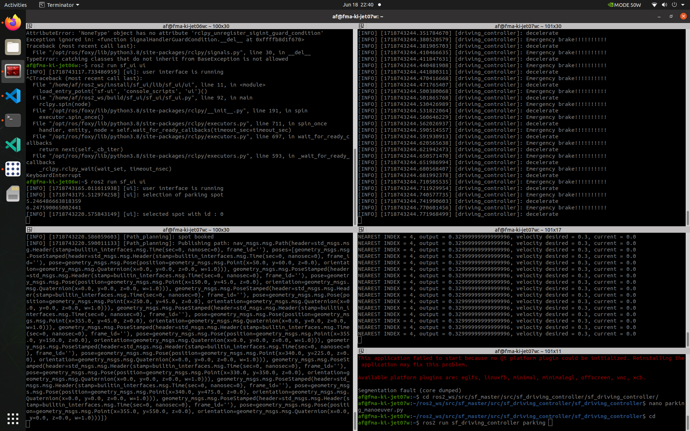

# Driving Controller Integration Test(IT_DC)

### Purpose
This integration test aims to verify that the DrivingController node in a ROS2 system works correctly in conjunction with other nodes, handling real-time data inputs and ensuring the vehicle behaves as expected in various scenarios such as normal driving, emergency braking, and parking maneuvers.

### Topics
`Subscriber`: `/ego_position`, `/planned_path`, `/env_model`, `/env_model`, `/pp_cmd_vel`, `/pm_cmd_vel`

`Publisher`:  `/cmd_vel`

# Test Case 1: Normal Operation with Valid Inputs(IT_DC_004)

### Precondition:
- The `Driving_controller` node is running.
- Valid `EgoPosition`, `Path`, `EMM`, and `Twist` messages are being published to the respective topics.

### Test Step:
1. Initialize the ROS2 environment and start the `Driving_controller` node.
2. Publish a valid `EgoPosition` message to the `/ego_position` topic.
3. Publish a valid `Path` message with multiple waypoints to the `/planned_path` topic.
4. Publish a valid `EMM` message to the `/env_model` topic.
5. Publish a valid `Twist` message to the `/pp_cmd_vel` topic (pure pursuit).
6. Monitor the `/cmd_vel` topic for published `Twist` messages.

### Expected Result:
- The node receives and processes the `EgoPosition`, `Path`, `EMM`, and `Twist` messages.
- The node publishes appropriate `Twist` messages to the `/cmd_vel` topic, indicating movement commands based on the received data.

# Test Case 2: Emergency Braking Condition(IT_DC_005)

### Precondition:
- The `Driving_controller` node is running.
- Valid `EgoPosition`, `Path`, `EMM`, and `Twist` messages are being published to the respective topics.
- Conditions are set such that the vehicle needs to perform an emergency brake.

### Test Step:
1. Initialize the ROS2 environment and start the `Driving_controller` node.
2. Publish a valid `EgoPosition` message to the `/ego_position` topic.
3. Publish a valid `Path` message with multiple waypoints to the `/planned_path` topic.
4. Publish a valid `EMM` message with close obstacle distances to the `/env_model` topic.
5. Publish a valid `Twist` message with a positive linear velocity to the `/pp_cmd_vel` topic (pure pursuit).
6. Monitor the `/cmd_vel` topic for published `Twist` messages.

### Expected Result:
- The node detects the close obstacle distances and triggers the emergency brake.
- The node publishes a `Twist` message with zero linear velocity to the `/cmd_vel` topic, indicating an emergency stop.

# Test Case 3: Reaching the Destination(IT_DC_006)

### Precondition:
- The `Driving_controller` node is running.
- Valid `EgoPosition`, `Path`, and `Twist` messages are being published to the respective topics.
- The vehicle reaches the final waypoint in the path.

### Test Step:
1. Initialize the ROS2 environment and start the `Driving_controller` node.
2. Publish a valid `EgoPosition` message near the final waypoint to the `/ego_position` topic.
3. Publish a valid `Path` message with the final waypoint to the `/planned_path` topic.
4. Publish a valid `Twist` message for parking maneuver to the `/pm_cmd_vel` topic.
5. Monitor the `/cmd_vel` topic for published `Twist` messages.

### Expected Result:
- The node detects the vehicle is near the final waypoint.
- The node switches to the parking maneuver mode.
- The node publishes appropriate `Twist` messages for parking to the `/cmd_vel` topic.

For video click on [Link](https://git.hs-coburg.de/SpotFinder/sf_driving_controller/src/branch/main/resource/Parking.MOV)
