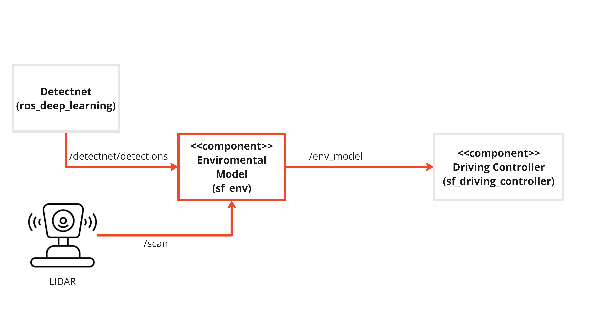

# Component Description

`Felix Ebert`

## Overview
This component is responsible for creating a comprehensive and
dynamic virtual model of the environment surrounding the vehicle based
on incoming data from the camera, Object-detection, LIDAR and the current position of the Ego-Vehicle. The Environmental Model is using sensor data fusion in order do create a accurate Model of the environment.

## Component Architecture



## ROS2 Topics

| IN/Out | Topic Name                     | Message Type                     | Description                                         |
|--------|--------------------------------|----------------------------------|-----------------------------------------------------|
| Input  | /detectnet/detections          | vision_msgs/msg/Detection2DArray | Detected Objects from Nvidia Detectnet              |
| Input  | /scan                          | sensor_msg/msg/LaserScan         | Detected Points from the LIDAR                      |
| Output | /env_model                     | sf_msgs/EMM                      | Fused data from Camera OD and LIDAR                 |

## Functionality

The Environment-model is subscibing to two different topics and merging the information and publishing one single topic, which contains the most important informations from the two messages. Upon receiving data, it processes it through callback functions.

The detectnet_callback function processes object detection data, mapping detected objects to predefined classes and storing them in an Environment Model Message (EMM).
classes:
*   0 = unknown
*   1 = car
*   2 = parking_spot
*   3 = plant
*   4 = pedestrian
*   5 = traffic_light

If a Object is of type parking_spot it will be stored in a seperatly list which contains only parking spots, to make further processing easier.

Laser scan data is processed in the scan_callback, where it's inserted into the same EMM message. The node utilizes a timer to periodically publish the populated EMM message at a rate of 33.3 hz, containing object and parking spot information and laser scan data. Additionally a list of corresponding angles is beeing created. angles[n] corresponde to ranges[n].

## Requirements

1. Intel Realsense camera
2. LIDAR
3. OptiTrack

## Dependencies
1. [Ros deeplearning](https://git.hs-coburg.de/Autonomous_Driving/ros_deep_learning)
2. [sf_msg](https://git.hs-coburg.de/SpotFinder/sf_msgs)
3. [ydlidar](https://git.hs-coburg.de/Autonomous_Driving/ydlidar_ros2)
4. [realsense_camera](https://github.com/IntelRealSense/realsense-ros)

## Installation
This repository needs to be cloned, built and sourced. It needs to be cloned to `/src` folder of the ROS2 workspace. This can be done by following the instruction provided in the [sf_master](https://git.hs-coburg.de/SpotFinder/sf_master.git).

## Run Steps

follow run steps in [sf_master](https://git.hs-coburg.de/SpotFinder/sf_master)

1. start the node
```bash
ros2 run sf_env env_model
```

## Object Detection
### General informations
The detectnet from Nvidia is being used for the objectdetection (od). The Model for the od was adapted through transferlearning to fit the requirements of SpotFinder.
Five different classes can be detected.
class 

| class_id | class_name         |
|--------  |--------------------|
| 1        | car                |
| 2        | parking_spot       |
| 3        | plant              |
| 4        | person             |
| 5        | traffic_light      |

### Dataset
For retraining the Model a Dataset of 1275 raw images was used. The division of the different classes within the raw Dataset can be seen in the table below.
The raw Dataset was Split 70:20:10 in Train-, Validation- and Test-set. The Trainset was augment by adding chnaged versions of images from the raw trainset. Three different effect have ben applied randomly
1. Shear: between -4° to 4° horizantal, between -10° to 10° vertical
2. Brightness: between -15% to 15%
3. Blur: between 0 and 3.5px
The size of the Traindaset increased from 893 to 2679 Images. Containing 893 raw images and 1786 edited images.

| class_name    | amount of total boxes | accuracy of the Model   |
|---------------|-----------------------| ------------------------|
| car           | 958                   | 81 %                    |
| parking_spot  | 783                   | 61 %                    |
| plant         | 1647                  | 65 %                    |
| person        | 735                   | 90 %                    |
| traffic_light | 1512                  | 31 %                    |

### Training

To train the Model two training cycles have been completed.

During the first cycle the whole new except the output layer was frozen so that the newly added output layers can adapt to the already existing Network. During this cycle a higher lr-rate of 0.001 and no rl-decay have been choosen so that the outputlayers can quickly adapt to the Model.

The second training cycle used the outcome of last Epoch of the fris tring cycle as input-model. The lr was dcreased to 0.0001 and a lr-decay of 0.00005 have to added. The lower lr and the lr-decay leads to a lower learning progress and adaptes of the Model during the later epochs and should increase the precision of the finetuning of the Model.

The loss function of each Model indicates the performance of the respecting Model. The best Model has a loss of 1.97 and a MAP-Score of 75%

| input-model                   | Epochs   | learning-rate | lr-decay   | freeze-net | batch-size |
|-------------------------------|----------|---------------|------------|------------|------------|
| mobilenet-v1-ssd-mp-0_675.pth | 20       | 0.001         | 0          | true       | 16         |
| Model of Epoch 20             | 100      | 0.0001        | 0.00005    | false      | 16         |