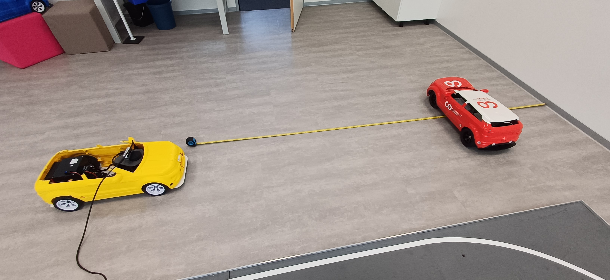
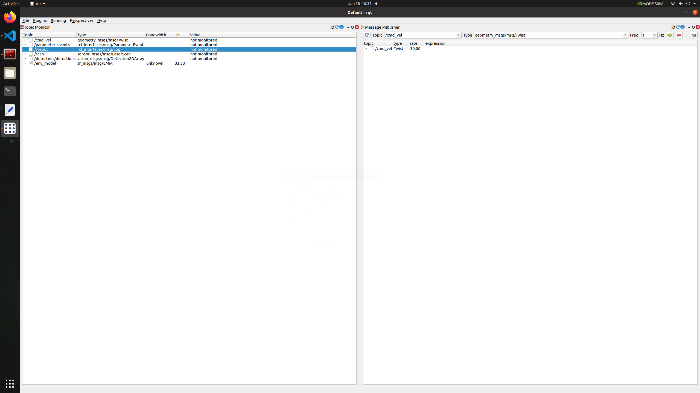
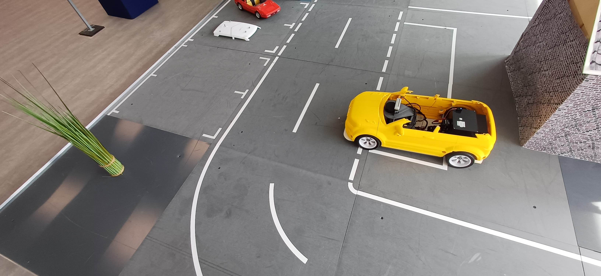
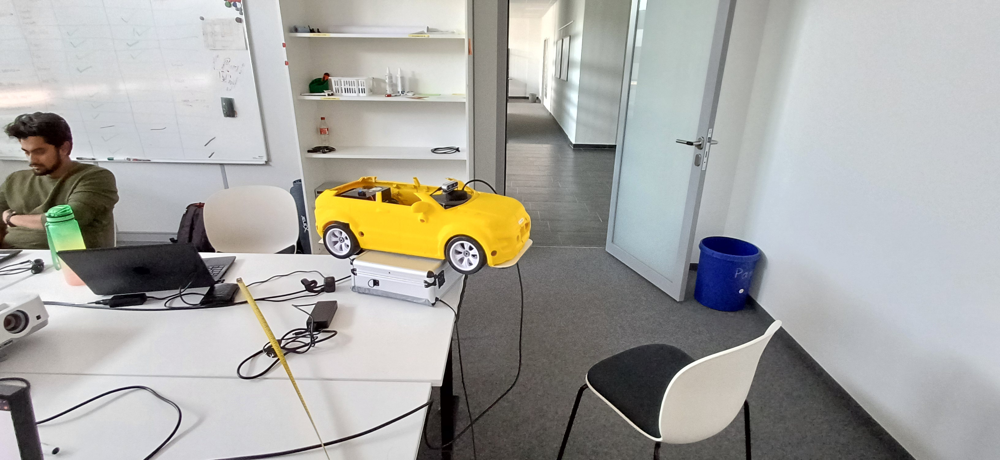
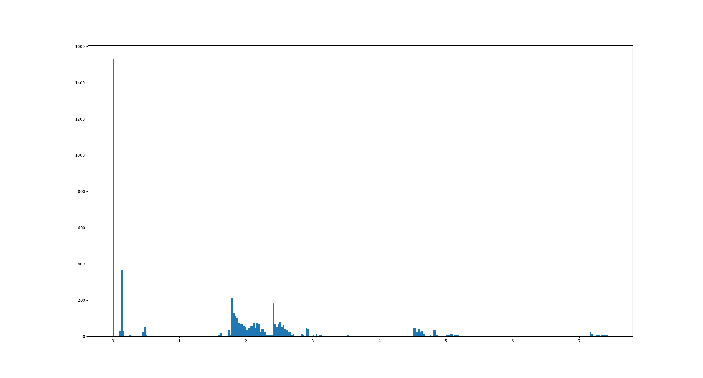
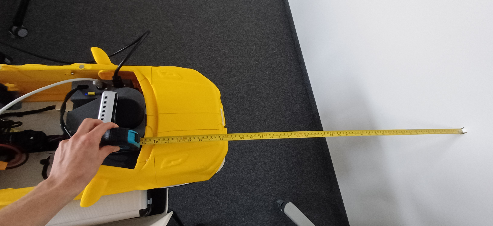
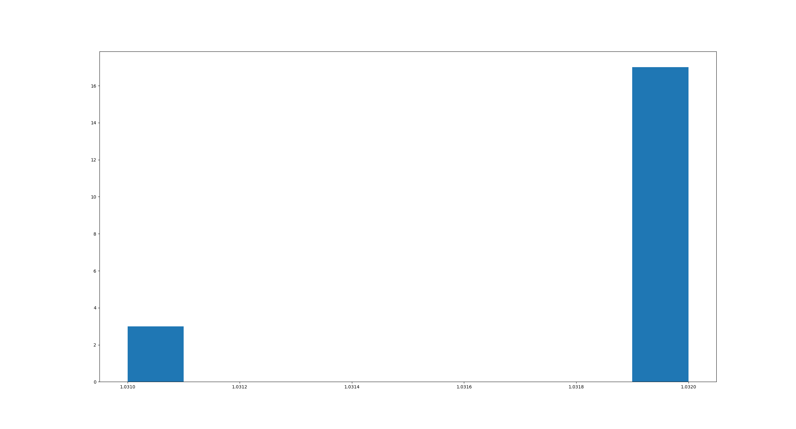

## Testcase: IT_ENV_MODEL_001

### Preparation:
1. The model car placed in a 3m distance from a white wall
2. A second model was positioned between the wall and the first model car in a distance of 2m to the first model car facing sideways
3. Starting all software components on the first model car
    1. The realsense camera was started with the command: "ros2 launch realsense2_camera rs_launch.py" from the terminal
    2. The detecnet was started with the command: "ros2 launch ros_deep_learning detectnet.ros2.launch" from the terminal
    3. The Environment model was started with the command: "ros run sf_env env_model" from the terminal
    4. starting rqt with the command: "rqt" from the terminal 

### Test execution
1. watch the topic /env_model in rqt
2. check the frequency
3. check the detected object inside the envivonment model message (emm)
4. move the second model car out of the screen

### Observation:
1. The frequency was constant at 33.33hz while executing the test 

2. detectnet could not be started

### Test results
The Test could not be executed
Test error

## Testcase: IT_ENV_MODEL_002

### Preparation:
1. Starting all software components on the model car
    1. The realsense camera was started with the command: "ros2 launch realsense2_camera rs_launch.py" from the terminal
    2. The detecnet was started with the command: "ros2 launch ros_deep_learning detectnet.ros2.launch" from the terminal
    3. The Environment model was started with the command: "ros run sf_env env_model" from the terminal
    4. starting rqt with the command: "rqt" from the terminal
2. The model car placed so that the detectnet is detecting exatly two parking spot and one plant 

### Test execution:
1. watch the topic /env_model in rqt
2. check the frequency
3. check the detected object inside the envivonment model message (emm)
4. check the detectet parking spots inside the emm

### Observations:
1. The frequency was constant at 33.33hz while executing the test 

2. Detectnet could not be started

### Test results
The Test could not be executed
Test error

## Testcase: IT_ENV_MODEL_003

### Preparation:
1. set the filtered output inside the observer component to -180° to 180°
2. place the model car in the middle of room and check that to obstacle is in range of 1m to the lidar
3. Starting all software components on the model car
    1. The LIDAR was started with the command: "ros2 run ydlidar ydlidar_node" from the terminal
    2. The Environment model was started with the command: "ros run sf_env env_model" from the terminal
    3. Start the observer Node with the command: "ros2 run sf_observer observer"
    4. starting rqt with the command: "rqt" from the terminal 

### Test execution:
1. watch the topic /env_model in rqt
2. check the frequency
2. check if the amount of angles and ranges inside the environmemt model message (emm) is exactly 505
3. evaluate the histogramm created by the observer component which contains all filtered ranges from the last 10 received emm

### Observations:
1. The frequency was constant at 33.33hz while executing the test 

2. The length of the angles array and the range array inside the emm is exactly 505
3. There are multiple measuremets for a range of 0cm and 13 cm 

### Test results
The amount of received points per emm message is correct, but there are many false measurmemts
Test failed

## Testcase: IT_ENV_MODEL_004

### Preparation:
1. set the filtered output inside the observer component to -91° to -89°
2. place the model in a 1m distance from the LIDAR in front of a wall
3. Starting all software components on the model car
    1. The LIDAR was started with the command: "ros2 run ydlidar ydlidar_node" from the terminal
    2. The Environment model was started with the command: "ros run sf_env env_model" from the terminal
    3. Start the observer Node with the command: "ros2 run sf_observer observer"
    4. starting rqt with the command: "rqt" from the terminal 

### Test execution:
1. watch the topic /env_model in rqt
2. check the frequency
2. check if the amount of angles and ranges inside the environmemt model message (emm) is exactly 505
3. evaluate the histogramm created by the observer component which contains all filtered ranges from the last 10 received emm

### Observations:
1. The frequency was constant at 33.33hz while executing the test 

1. The length of the angles array and the range array inside the emm is exactly 505
2. all values have been in range between 99 cm - 100 cm 

### Test results
1. The frequency was constant at 33.33hz while executing the test
2. The length of the array was 505
3. The meassured ranges are matching the expected output
Test passed