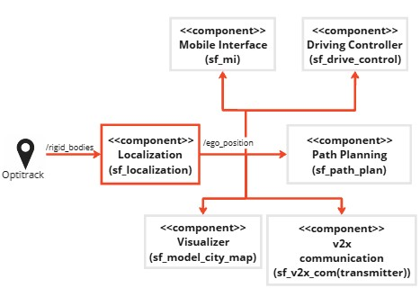

# Component Description

`Yash Mathukiya`

## Overview

The sf_localization Component responsible for providing real-time vehicle data such as X and Y coordinates in ModelCity format, Pose/orientation of vehicle and geographic coordinates (latitude, longitude). This data is vital for precise vehicle positioning within environment. Explore more for a deeper understanding about component Struture & functionality, some requirments and steps needs to be done to use this component.

## Component Architecture



## ROS2 Topics

| IN/Out | Topic Name    | Message Type |              Description                          |
|--------|---------------|--------------|---------------------------------------------------|
| Input  | /pose_modelcars | mocap_msgs/msg/RigidBodies  |  The Optitrack message containing vehicle details. |
| Output | /ego_position | sf_msgs/msg/EgoPosition  | Real-time ego vehicle's Data.|

## Functionality

The Localization node is a component designed to receice own position and also the transformation of vehicle position data from a motion capture system into global coordinates and subsequently publish this data.

### Subscriptions
The Localization node subscribes to the following topic to receive real-time data:

/pose_modelcars: Receives the position and orientation data of vehicles from the Optitrack motion capture system via RigidBodies messages. The rigid_bodies_callback method processes this data to extract the relevant information for the ego vehicle.
###Publishers
The node utilizes the following publisher to share it's position as per modelcity coordinates, the calculated global position and orientation of the ego vehicle:
/ego_position: Publishes the ego vehicle's coordinates as per modelcity, global position and orientation using EgoPosition messages. The rigid_bodies_callback method handles this functionality.
### Initialization
The node sets initial parameters for the vehicle and the model city:
Vehicle ID: Sets the it own vehicle ID to "7" to identify the own relevant data in the received messages.
Initial Coordinates: Sets the initial latitude and longitude values, which correspond to the origin of the model city. The initial height (h_0) is set to 0, assuming sea level.
### Data Processing
The rigid_bodies_callback method performs the following operations when processing received RigidBodies messages:
Extract Rigid Body Data: Iterates through the list of rigid bodies in the message to find the one with the matching own vehicle ID '7'.
Convert to Global Coordinates: Converts the vehicle's local modelcity position (x, y) to global coordinates (latitude, longitude) using the pymap3d library.
Extract Orientation: Extracts the quaternion components of the vehicle's orientation and converts them to Euler angles (roll, pitch, yaw) using the tf_transformations library.
Populate Message: Populates an EgoPosition message with local model city position, the converted position and orientation data.
## Requirements

1. [V2X msg](https://git.hs-coburg.de/Autonomous_Driving/v2x.git)

2. [mocap_msgs](https://git.hs-coburg.de/pau5849s/mocap_msgs.git) 

3. mocap_optitrack is needed, for installation [click here](https://github.com/ros-drivers/mocap_optitrack).

## Dependency

1. [sf_msgs](https://git.hs-coburg.de/SpotFinder/sf_msgs.git)


## Installation
This repository needs to be cloned, built and sourced. It needs to be cloned to `/src` folder of the ROS2 workspace. This can be done by following the instruction provided in the [sf_master](https://git.hs-coburg.de/SpotFinder/sf_master.git).


## Run Steps

follow run steps in the [sf_master](https://git.hs-coburg.de/SpotFinder/sf_master.git)

1. To get vehicle position run this command.

```bash
ros2 run sf_localization sf_ego_localization
```
