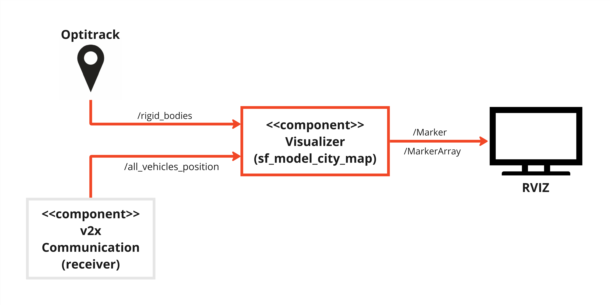

# Component Description

`Om Rajhans`

## Overview

This is the mapping component, which is responsible for visualizing the ego vehicle and other cars on the map. Here custom map is used which is of model city and this map can be seen below. 

## Component Architecture



## ROS2 Topics

| IN/Out | Topic Name            | Message Type                      |              Description                          |
|--------|-----------------------|-----------------------------------|---------------------------------------------------|
| Input  | /rigid_bodies         | mocap_msgs/msg/RigidBodies        | The Optitrack message containing vehicle details |
| Input  | /all_vehicles_position| sf_msgs/msg/VehiclesPosition      | Real-time other vehicles Data                    |
| Output | /ego_pos_viz         | visualization_msgs/msg/Marker     | Real-time ego vehicle's visualization     |
| Output | /cars_pos_viz        | visualization_msgs/msg/MarkerArray| Real-time other vehicles visualization     |

## functionality

sf_model_city_map component integrates with the Optitrack Mocap system and v2x server, subscribing to the topic `/rigid_bodies` and `/all_vehicles_position` for real-time ego vehicle Position and other vehicles positions respectively. Furthermore it visualizes the map and vehicles as a marker and markerarray using Rviz2. 

## Requirements

1. mocap_optitrack is needed, for installation [click here](https://github.com/ros-drivers/mocap_optitrack).

## Dependencies

1. [sf_msgs](https://git.hs-coburg.de/SpotFinder/sf_msgs.git)


## Installation

This repository needs to be cloned, built and sourced. It needs to be cloned to `/src` folder of the ROS2 workspace. This can be done by following the instruction provided in the [sf_master](https://git.hs-coburg.de/SpotFinder/sf_master.git).


## Run Steps

follow run steps in the [sf_master](https://git.hs-coburg.de/SpotFinder/sf_master.git)

1. Run following command to visualize map
```bash
ros2 launch nav2_bringup localization_launch.py map:='/(path to)/map.yaml'
```

2. On 2nd terminal run rviz2
```bash
rviz2
```
To visualize map click on `Add` -> `By Tpoic` -> `/map`. If map is not available simply just stop and run again the command for map.

3. On new terminal run following command to visualize ego vehicle
```bash
ros2 run sf_model_city_map sf_viz_ego
```
To visualizs ego vehicle on map click on `Add` -> `By Topic` -> `Marker`

4. On new terminal run following command to visualize other vehicle
```bash
ros2 run sf_model_city_map sf_viz_cars
```
To visualizs other vehicle on map click on `Add` -> `By Topic` -> `MarkerArray`