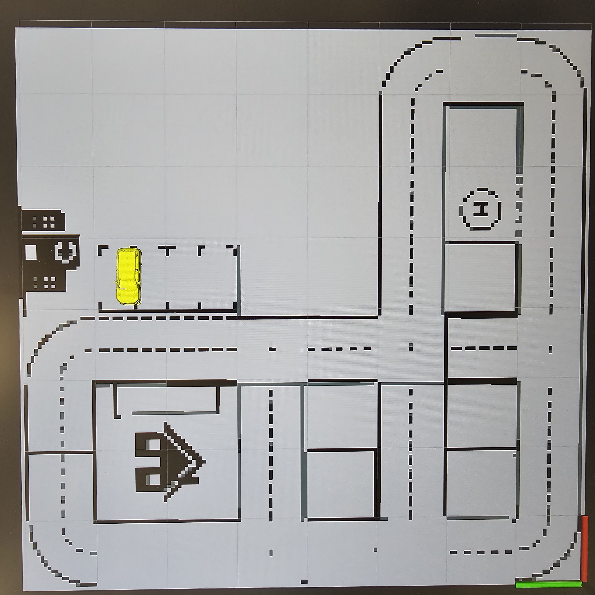

## Testcase: IT_Model_City_Map_001

### Preparation:
1. The model car placed at (6.5, 4.5)
2. Run script using command "ros2 run sf_model_city_map sf_viz_ego"
3. Run Rviz2

### Test execution
1. watch the topic /pose_modelcars in rqt
2. check the coordinates for rigid body [1]
3. Check the coordinates being published on terminal

### Observation:
1. On Rviz2, see where the car marker is being published 

### Test results
The Test successfully executed

