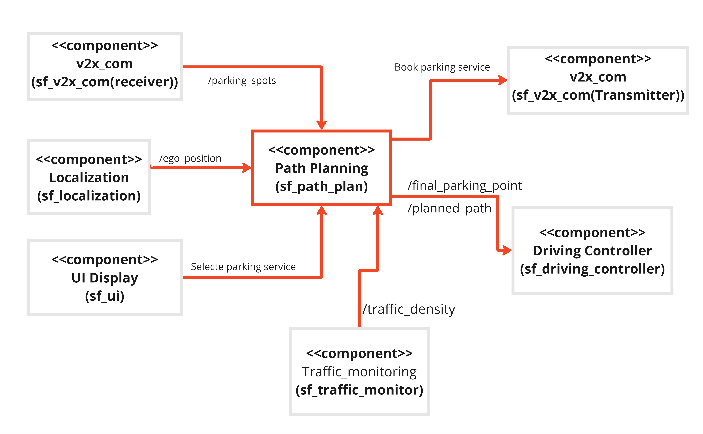

# Component Description

`Yash Mathukiya: Path Planning & Bhumin Chodvadiya: A* Algorithm`

## Overview
### Path Planning
Path planning defines a ROS2 (Robot Operating System 2) node named PathPlan, which is designed to manage autonomous path planning for a vehicle. This node interacts with various ROS2 topics and services to receive the vehicle's current position, identify available parking spots, calculate the optimal path using the A* algorithm, and publish the planned path along with the final selected parking point. The PathPlan node ensures efficient and effective navigation to the nearest available parking spot in an automated manner.

### A* Algorithm
This is a script that holds an A star pathfinding algorithm designed to find the shortest path between two points in a graph, given Euclidean distance and traffic density. In this graph, there are nodes and edges. The nodes identify a location; the edges represent the links between the nodes. The script provides a Node class to abstract the information of every node to be used in the pathfinding process, together with coordinate and cost values and parent nodes. It also includes functions for parsing map and traffic data, distance computation, and the execution of the A* search algorithm. With these in place, the script will have the ability to find the shortest path, taking into consideration the traffic conditions affecting traversal costs.

## Component Architecture


## ROS2 Topics

| IN/Out | Topic Name                     | Message Type                     | Description                                   |
|--------|--------------------------------|----------------------------------|-----------------------------------------------|
| Input  | /ego_position                  | sf_msgs/msg/EgoPosition          | Real-time ego vehicle's coordinates           |
| Input  | /parking_spots                 | sf_msgs/msg/ParkingSpotContainer | List of available parking spot                |
| Output | /traffic_density               | sf_msgs/msg/StreetContainerInfo  | Real-time Traffic Data                        |
| Output | /final_parking_point           | sf_msgs/msg/SelectedParking      | Selected Parking coordinates                  |
| Output | /planned_path                  | nav_msgs/Path                    | X & Y coordinates of nodes of path            |

## ROS2 service

| IN/Out | service Name                   | service Type                     | Description                                   |
|--------|--------------------------------|----------------------------------|-----------------------------------------------|
| Output  | Select parking                | sf_msgs/msg/EgoPosition          | Request for select parking                    |
| Output  | Book parking                  | sf_msgs/msg/ParkingSpotContainer | Request for book parking spot                 |
| Input  | Select parking                 | sf_msgs/msg/EgoPosition          | Receive responce of selected parking          |
| Input  | Book parking                   | sf_msgs/msg/ParkingSpotContainer | Receive responce of booked parking spot       |
## Functionality

### Path Planning
The PathPlan node is a component designed to calculate optimal paths and book the selected parking spot. It integrates with multiple ROS2 topics and services to achieve this functionality.
#### Subscriptions
The PathPlan node subscribes to the following topics to receive real-time data:
/ego_position: Receives the vehicle's current position via EgoPosition messages. The egoposition_callback function updates the node's internal state with the latest ego vehicle position.
/parking_spots: Receives information about available parking spots through ParkingSpotContainer messages. The parkingspots_callback function processes the list of parking spots and checks for availability.
/traffic_density: Receives traffic data via StreetInfoContainer messages. The traffic_data_callback function updates the node with the latest traffic density information.
#### Publishers
The node utilises the following publishers to share the calculated path and the final selected parking point:
/final_parking_point: Publishes the final selected parking point using SelectedParking messages. The publish_final_parking_point function handles this functionality.
/planned_path: Publishes the planned path to the selected parking point using Path messages. The publish_path function is responsible for this publication.
#### Service Clients
The node sets up clients for the following services to handle parking spot selection and booking:
select_parking_spot: Interacts with the SelectSpot service to select the nearest parking spot. The select_parking_spot method sorts parking spots by distance and selects the closest ones.
book_parking_spot: Interacts with the BookSpot service to book the selected parking spot. The book_nearest_parking_spot method sends a booking request and handles the response.
#### Pathfinding
The node uses the A* algorithm for pathfinding. It performs the following steps:
Map Data Parsing: Uses the parse_map_data function to read map data from a specified file and set up nodes and edges for the A* algorithm.
Start and End Positions: Sets the start position to the ego vehicle's current coordinates and the end position to each available parking spot's coordinates.
Calculation: Runs the A* algorithm via the astar function to determine the optimal path to each available parking spot.
Calculation: Uses the calculate_distance method to calculate the total distance of the path by summing the costs of edges in the path.
#### Select Parking Spot
The select_parking_spot method performs the following operations:
Ensures parking spots are available and the ego position is known.
Calculate Distances: Iterates through available parking spots, calculates paths and distances using the A* algorithm, and stores them.
Sort and Select: Sort the parking spots by distance and select the two closest ones.	Service Call: Sends a request to the SelectSpot service to select the nearest parking spot and updates the selected spot ID.
#### Book Parking Spot
The book_nearest_parking_spot method sends a booking request for the selected parking spot and handles the response:
Service Call: Sends a request to the BookSpot service with the selected spot ID.
Response Handling: Checks if the booking was successful and, if so, cancels the booking timer and starts publishing the path and final parking point.
#### Asynchronous Execution
The node manages asynchronous service calls and ensures efficient execution using callback groups and a multi-threaded executor:
Callback Groups: Uses MutuallyExclusiveCallbackGroup to handle select_parking_spot and book_parking_spot services in different threads, allowing for concurrent execution without conflicts.
Multi-threaded Executor: Utilizes MultiThreadedExecutor to manage the node and its callbacks, ensuring that multiple operations can be handled simultaneously.


### A* Algorithm
The Node class encapsulates the node's attributes in the graph. These attributes include coordinates, cost values for pathfinding, such as g, h, f, and its parent node. The parse_map_data function reads the map data from a file and traffic density from a dictionary. After reading, it creates nodes and edges with cost adjustment for the traffic conditions. The calculate_distance function calculates the Euclidean distance between two points and is used with the heuristic function to determine the closest node to a given position. The astar function actually performs the A* pathfinding algorithm. It sets up costs for the start node, uses a priority queue to manage the open list, updates costs for neighbors, and reconstructs the path once the end node is reached. The output will be the shortest path from start to end positions, considering both distance and traffic density.

## Dependencies

1. [sf_msgs](https://git.hs-coburg.de/SpotFinder/sf_msgs.git).
2. [sf_localization](https://git.hs-coburg.de/SpotFinder/sf_localization.git)
3. [sf_v2x_com](https://git.hs-coburg.de/SpotFinder/sf_v2x_com.git) 
4. [sf_v2x_server](https://git.hs-coburg.de/SpotFinder/sf_v2x_server.git)
5. [sf_ui](https://git.hs-coburg.de/SpotFinder/sf_ui.git) 
6. [sf_traffic_monitor]((https://git.hs-coburg.de/SpotFinder/sf_traffic_monitor.git))

## Installation

This repository needs to be cloned, built and sourced. It needs to be cloned to `/src` folder of the ROS2 workspace. This can be done by following the instruction provided in the [sf_master](https://git.hs-coburg.de/SpotFinder/sf_master.git).

## Run Steps

follow run steps in the [sf_master](https://git.hs-coburg.de/SpotFinder/sf_master.git)

1. Run the `sf_ego_localization` node by using the following command.

``` bash
ros2 run sf_localization sf_ego_localization
```
2. Run the `sf_v2x_com` node by using the following command.

``` bash
ros2 run sf_v2x_com receiver
```
3. Run the `ui` node by using the following command.

``` bash
ros2 run sf_ui ui
```

4. Run the `v2x_server` node by using the following command.

``` bash
ros2 run sf_v2x_server v2x_server
```
5. 4. Run the `sf_traffic_monitor` node by using the following command.

``` bash
ros2 run sf_traffic_monitor traffic_monitor
```
5. start the node

```bash
ros2 run sf_path_plan path_planning
```

