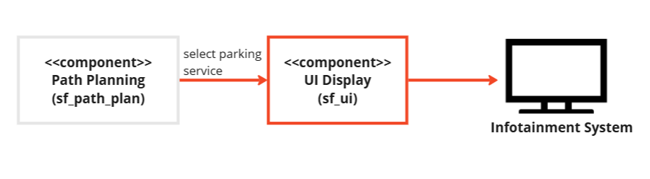
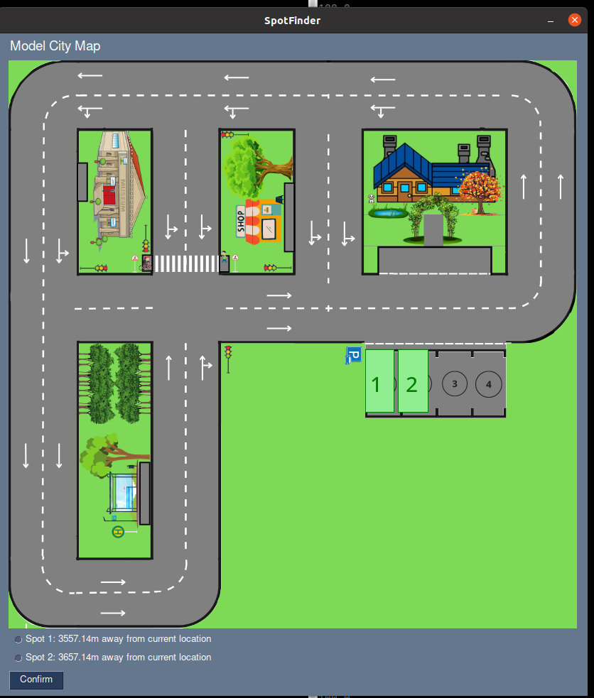

# Component Description

`Haaris Khan` 

# Overview
The SpotFinder User Interface is a ROS (Robot Operating System) node designed to facilitate the selection of a parking spot among available options. It provides a graphical user interface (GUI) using PySimpleGUI, allowing users to interactively choose a parking spot based on their preferences. 

## Component Architecture


## ROS2 Service

| Req/Res | Service Name                     | Message Type                     | Description                                         |
|--------|--------------------------------|----------------------------------|-----------------------------------------------------|
| Request  | select_parking_spot              | sf_msgs.msg.parkingSpot                    | List of available parking spots             |
| Response | select_parking_spot              | Int 32            | ID of selected parking spot.     |


# Functionality
The User Interface node helps user interact with the system easily. It starts a service called select_parking_spot to handle requests for choosing parking spots. When it starts, it sets up a visual interface (like a screen) so users can see and choose available parking spots. Users can pick a spot on this screen, and the system will process their choice and tell them which spot they picked. To make it smoother, the system will close the screen automatically if nobody picks a spot within a certain time.

# User interface Output


# Requirements

To run this project, you need:
- Parking list from sf_path_planning component..
- Python 3.x
- ROS 2 (Robot Operating System 2)
- Tkinter.
- PIL (Python Imaging Library)
- sf_msgs package.

# Dependencies
- PySimpleGUI 
- ROS 2 (Robot Operating System 2) 
- sf_msgs (ROS 2 message and service definitions)

# Installation
This repository needs to be cloned, built and sourced. It needs to be cloned to `/src` folder of the ROS2 workspace. This can be done by following the instruction provided in the [sf_master](https://git.hs-coburg.de/SpotFinder/sf_master.git).

# Run Steps
 follow run steps in [sf_master](https://git.hs-coburg.de/SpotFinder/sf_ui)

 1. start the node
 ```bash
ros2 run sf_ui ui
