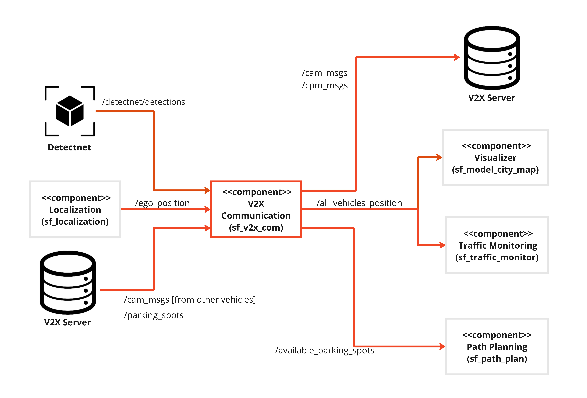

# Component Description

`Author: Rakshith Kumar Shetty`

## Overview

This component is responsible for retrieving the ego vehicle position and heading (yaw) and transmitting this data via V2X. It is also responsible for receiving V2X messages that are transmitted from other vehicles. This is achieved using the CAM messages. This component also transmits the detected objects from the re-trained [`detectnet`](https://github.com/dusty-nv/jetson-inference) via V2X as CPM messages.

The receiver part of the component extracts the useful information from the received CAM messages of other vehicles and this information is further transmitted to other internal components. The receiver also gets the list of the available parking spots from the v2x server in global WGS co-ordinates and converts it to the local model city co-ordinates which can further be used by internal components for booking.

## Component Architecture

 

## ROS2 Topics

| In/Out | Topic Name  | Message Type | Description |
|--------|-------------|--------------|-------------|
| Input  | /detectnet/detections  | vision_msgs/msg/Detection2DArray   | Detected Objects from Nvidia Detectnet           |
| Input  | /cam_msgs | v2x/msg/CAM   | Vehicle position and heading from other vehicles            |
| Input | /ego_position | sf_msgs/msg/EgoPosition  | Real-time ego vehicle's Data |
| Input | /parking_spots | sf_msgs/msg/ParkingSpotContainer  | List of available spots in WGS co-ordinates |
| Output | /cam_msgs | v2x/msg/CAM    | Ego vehicle position and heading  |
| Output | /cpm_msgs | v2x/msg/CPM    | Detected object classes as per ETSI standard  |
| Output | /all_vehicles_position | sf_msgs/msg/VehiclesPosition    | Position and yaw angle of other vehicles according to model city  |
| Output | /available_parking_spots | v2x/msg/EvcsnPdu    | List of available parking spots in model city co-ordinates |


## Functionality

V2X Communication has two nodes, a transmitter node and a receiver node. The trasnsmitter node subscribes to the `/ego_position` to get the location of the ego vehicle and converts this position to WGS84 co-ordinates by taking the model city origin as the reference position. The yaw data from `/ego_position` is converted as per ETSI standard ([HeadingValue](https://forge.etsi.org/rep/ITS/asn1/cdd_ts102894_2/-/blob/v2.1.1/docs/ETSI-ITS-CDD.md#HeadingValue)). The converted co-ordinates and heading are transmitted via the `/cam_msgs` which can be received by other vehicles over the ROS network. The detected object classes from `/detectnet/detections` are assigned to their respective classes as per ETSI standard ([StationType](https://forge.etsi.org/rep/ITS/asn1/cdd_ts102894_2/-/blob/v2.1.1/docs/ETSI-ITS-CDD.md#StationType)) and are trasmitted via the `/cpm_msgs`. 

The receiver node subscribes to `/cam_msgs` and extracts vehicle id, global co-ordinates and heading of the transmitting vehicle. The WGS84 co-ordinates and heading are converted to model city co-ordinates and yaw angle respectively and are published over `all_vehicles_position` which is further used by the required components. The receiver node also subscribes to the `/parking_spots` from the v2x server and retrieves the list of available parking spots which are in global co-ordinates and converts then into local co-ordinates and publishes it over `/available_parking_spots`.

NOTE: Since there were issues with `/cam_msgs` being generated by other vehicles, a CAM generator for all vehicles was created for internal use in case the issue persits. These messages are being generated by the `sf_cam_server` node in the `sf_v2x_server` and are being published on `/common_topic_name`. This simulates the necessary information transmitted from the CAM messages generated by other vehicles.

More information on the ETSI Standard (Heading and StationType) can be found [here](https://forge.etsi.org/rep/ITS/asn1/cdd_ts102894_2/-/blob/v2.1.1/docs/ETSI-ITS-CDD.md).

## Dependency

1. [ROS Deeplearning](https://git.hs-coburg.de/Autonomous_Driving/ros_deep_learning)

2. [sf_msgs](https://git.hs-coburg.de/SpotFinder/sf_msgs.git).

3. [sf_v2x_server](https://git.hs-coburg.de/SpotFinder/sf_v2x_server.git).

4. [sf_localization](https://git.hs-coburg.de/SpotFinder/sf_localization.git). 

## Installation
This repository needs to be cloned, built and sourced. It needs to be cloned to `/src` folder of the ROS2 workspace. This can be done by following the instruction provided in the [sf_master](https://git.hs-coburg.de/SpotFinder/sf_master.git).

## Run Steps

Follow run steps in [sf_master](https://git.hs-coburg.de/SpotFinder/sf_master)

1. Start the transmitter node
```bash
ros2 run sf_v2x_com transmitter
```

2. Start the receiver node
```bash
ros2 run sf_v2x_com receiver
```