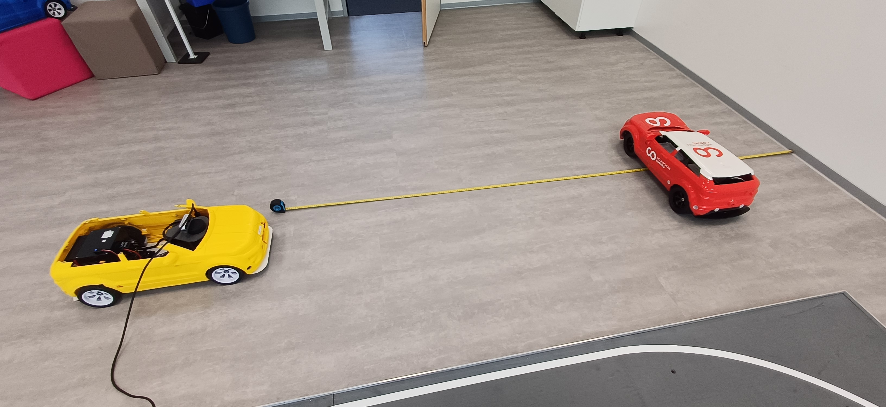
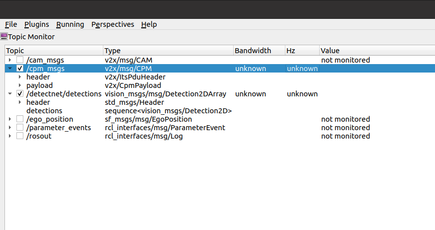
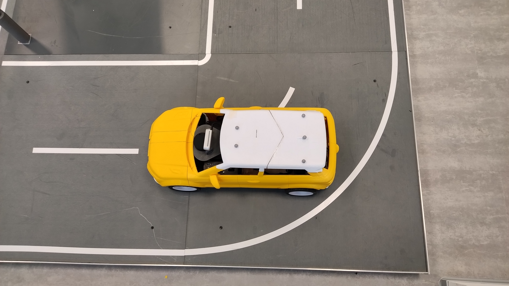
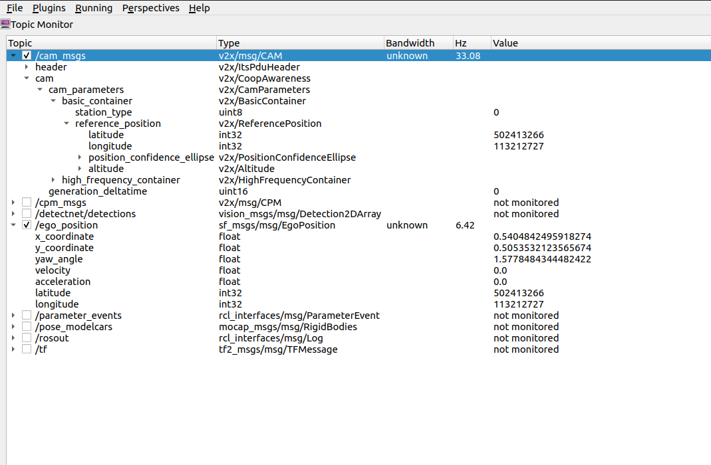
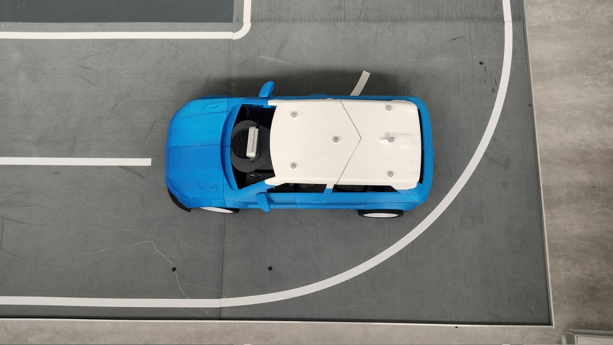
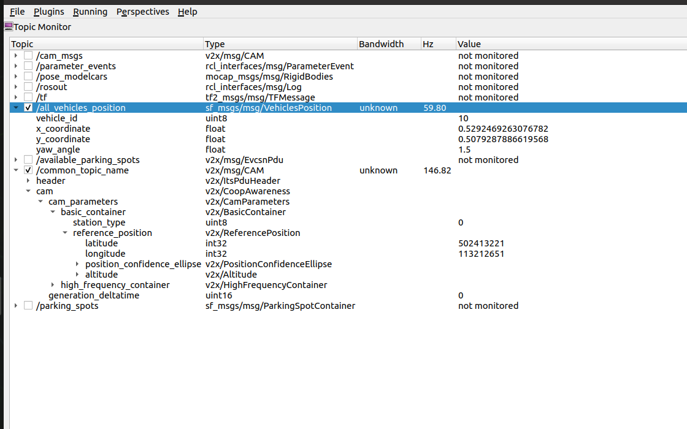

## Testcase: IT_V2X_COM_TX_001

### Preparation:
1. The model car placed in a 3m distance from a white wall
2. A second model was positioned between the wall and the first model car in a distance of 2m to the first model car facing sideways
3. Starting all software components on the first model car
    1. The realsense camera was started with the command: "ros2 launch realsense2_camera rs_launch.py" from the terminal
    2. The detecnet was started with the command: "ros2 launch ros_deep_learning detectnet.ros2.launch" from the terminal
    3. The V2X Com Transmitter node was started with the command: "ros2 run sf_v2x_com transmitter" from the terminal
    4. starting rqt with the command: "rqt" from the terminal 

### Test execution
1. watch the topic /cpm_msgs in rqt
2. check the detected object inside the envivonment model message (emm)
3. move the second model car out of the screen

### Observation:
1. The topic /cpm_msgs was created and the frequency was unknown since there is no detection to publish any data 

2. detectnet could not be started

### Test results
The Test could not be executed
Test error

## Testcase: IT_V2X_COM_TX_002

### Preparation:
1. The modelcar is placed in model city such that the centre of the rear axel of the car is at approx 50cm in x and 50cm in y and facing along y
2. Starting all software components on the first model car
    1. The localization was started with the command: "ros2 run sf_localization sf_ego_localization" from the terminal
    2. The V2X Com Transmitter node was started with the command: "ros2 run sf_v2x_com transmitter" from the terminal
    3. starting rqt with the command: "rqt" from the terminal 

### Test execution:
1. watch the topic /ego_position and /cam_msgs in rqt
2. check the frequency
3. check the position x, y in /ego_position and latitude, longitude in /cam_msgs

### Observations:
1. The frequency of /ego_position was at 6.42hz and that of /cam_msgs was at 33.08hz while executing the test 

### Test results
1. The x and y value from /ego_position was 0.5404 and 0.5053 respectively. This is within the expected range.
2. The latitude and longitude values from /cam_msgs was 502413266 and 113212727 respectively. This is also within the expected range.

Test passed

## Testcase: IT_V2X_COM_TX_003

### Preparation:
1. The blue modelcar (CarID = 10)is placed in model city such that the centre of the rear axel of the car is at approx 50cm in x and 50cm in y and facing along y
2. Starting all software components on the first model car
    1. The V2X CAM Server generating the CAM messages for other vehicles was started with the command: "ros2 run sf_v2x_server cam_server" from the terminal
    2. The V2X Com Receiver node was started with the command: "ros2 run sf_v2x_com receiver" from the terminal
    3. starting rqt with the command: "rqt" from the terminal 

### Test execution:
1. watch the topic /common_topic_name and /all_vehicles_position in rqt
2. check the frequency
3. check the position latitude, longitude in /common_topic_name and x, y in /all_vehicles_position

### Observations:
1. The frequency of /common_topic_name was at 146.82hz and that of /all_vehicle_position was at 59.80hz while executing the test 

### Test results
1. The latitude and longitude values from /cam_msgs was 502413221 and 113212651 respectively. This is also within the expected range.
2. The x and y value from /ego_position was 0.5292 and 0.5079 respectively, this is within the expected range. and vehicle_id is 10. 

Test passed