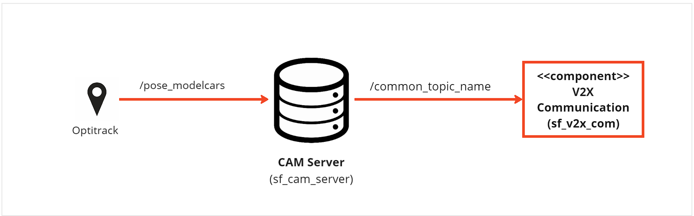
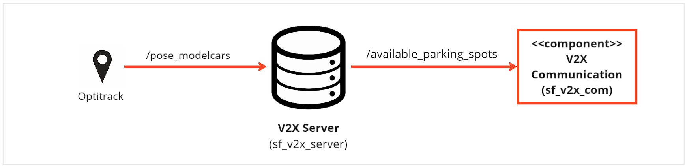

# Component Description

`Bhumin Chodvadiya`

## Overview

The V2X-Server component simulates both vehicle-to-everything communication and parking spot management within a model city environment. It consists of two main ROS nodes: CAMGeneratorServerNode and V2XServer.

### CAMGeneratorServerNode
The CAMGeneratorServerNode is simulating other vehicles which are publishing their CAM-Messages and is only being used during develpoement to be indepentend of other Systems.

### V2XServer
The V2XServer simulates the infrastructure present in a real-world scenario. It publishes information about available parking spots within the model city and provides functionality to book these spots.

## Component Architecture

### CAMGeneratorServerNode


### V2XServer


## ROS2 Topics

### CAMGeneratorServerNode

| IN/Out | Topic Name                     | Message Type                     | Description                                              |
|--------|--------------------------------|----------------------------------|----------------------------------------------------------|
| Input  | /pose_modelcars                | /mocap_msgs/msg/RigidBodies      | Topic published by OptiTrack contaning vehicle positions |
| Output | /common_topic_name               | /v2x/msg/CAM                     | Cam message for all Vehicles inside pose_modelcars       |

### V2X Server

| IN/Out | Topic Name                     | Message Type                     | Description                                                            |
|--------|--------------------------------|----------------------------------|------------------------------------------------------------------------|
| Input  | /pose_modelcars                | /mocap_msgs/msg/RigidBodies      | Topic published by OptiTrack contaning vehicle positions               |
| Input  | /book_parking_spot             | /sf_msgs/srv/BookSpot            | Service to book a parking Spot                                         |
| Output | /available_parking_spots       | /v2x/msg/EvcsnPdu                | Containg the information about all parking spots inside the model city |
 
## functionality

### CAMGeneratorServerNode
The CAMGeneratorServerNode is subscribing to the /pose_modelcars topic, which provides the positions of vehicles as RigidBodies messages from OptiTrack. For each vehicle described in these messages, the node generates a CAM (Cooperative Awareness Message). The generated CAM messages are then published on the /common_topic_name topic, allowing other nodes or systems to be aware of the simulated vehicles. 

### V2X Server
The main functionality of the `V2X-Server` is publishing all available parking Spots inside the Model-City as a EVCSN-Message. The Positions of the parking Spots itself are defined inside a .json-file (`parking_spots.json`). Each parking spot is described with attributes such as ID, coordinates (`x_coordinte` and `y_coordinte`), dimensions (`width` and `length`), and status (status indicating whether the spot is occupied or not).To determine the availability of each parking spot, the server subscribes to the `/pose_modelcars` topic for vehicle position updates from OptiTrack. It checks if the position of any vehicle overlaps with a parking spot's location. If an overlap is detected or if a spot is already booked, it marks the parking spot as occupied in the EVCSN message.

The seconds functionality deals with booking of parking spot. Users can request the booking of a parking spot by sending a service request to `/book_parking_spot`. The request includes the ID (`spot_id`) of the parking spot to be booked. Upon receiving a booking request, the server checks two conditions:
   1. Whether the parking spot is currently unoccupied (status is 0).
   2. Whether the spot has not been booked by another user within the last 60 seconds (maximum booking time).

If the Spot is free the V2X will book the parking Spot for 60 seconds. If the maximum booking time is over and the parking spot is still not occupied the booking will be cancled and it can be booked again.

The tolerance values are used to determine the proximity between a vehicle and a parking spot.
`spot_tolerance_x` = 0.25 meters (East-West direction) and `spot_tolerance_y` = 0.15 meters (North-South direction): This value is chosen based on typical vehicle dimensions and the need to account for slight inaccuracies in vehicle positioning systems. Ensuring that even if the vehicle is slightly off-center, it will still be recognized as occupying the spot. 

## Requirements

### CAMGeneratorServerNode

1. [mocap_msgs](https://git.hs-coburg.de/pau5849s/mocap_msgs.git) 

2. mocap_optitrack is needed, for installation [click here](https://github.com/ros-drivers/mocap_optitrack).

### V2XServer

1. [mocap_msgs](https://git.hs-coburg.de/pau5849s/mocap_msgs.git) 

2. mocap_optitrack is needed, for installation [click here](https://github.com/ros-drivers/mocap_optitrack).

## Run Steps

### CAMGeneratorServerNode

follow run steps in the [sf_master](https://git.hs-coburg.de/SpotFinder/sf_master.git)

1. start the node
```bash
ros2 run sf_cam_server cam_server
```

### V2X-Server

follow run steps in the [sf_master](https://git.hs-coburg.de/SpotFinder/sf_master.git)

1. start the node
```bash
ros2 run sf_v2x_server v2x_server
```