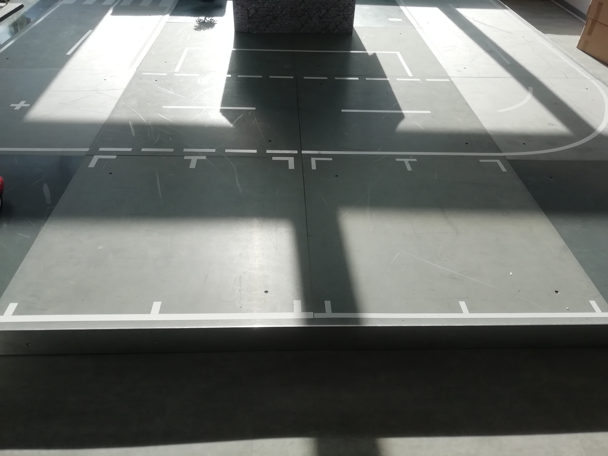
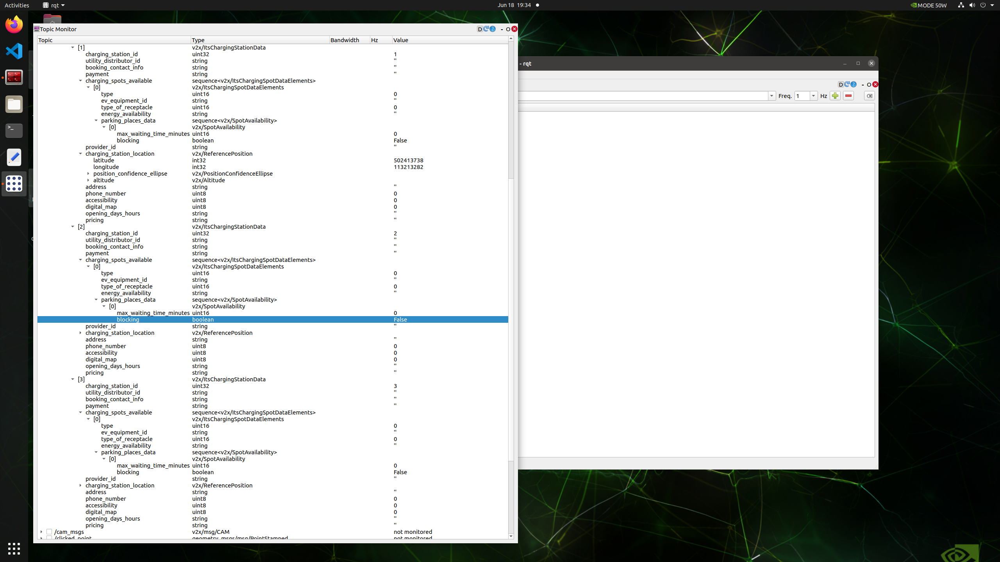
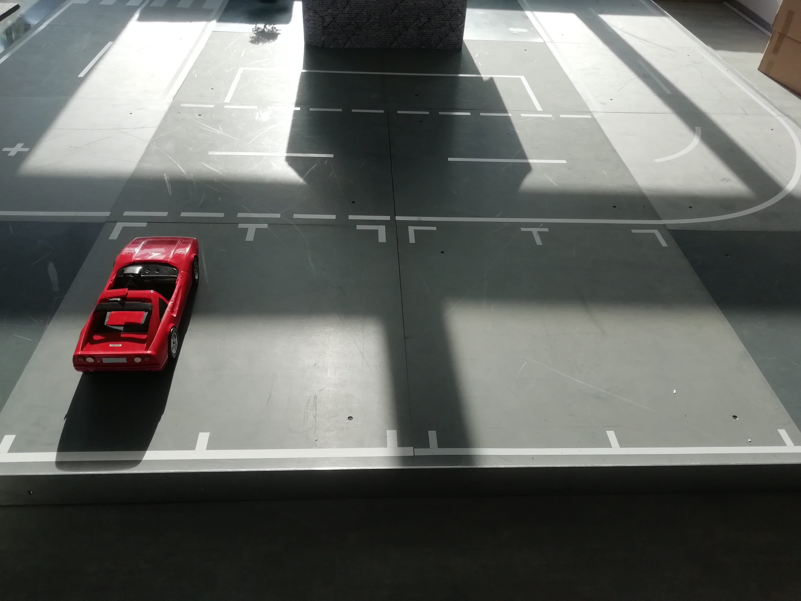
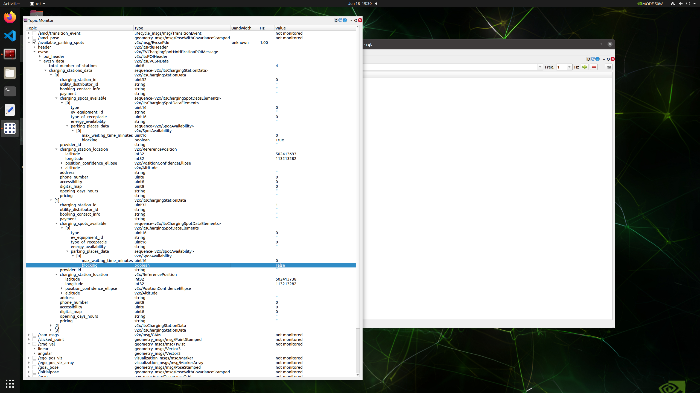
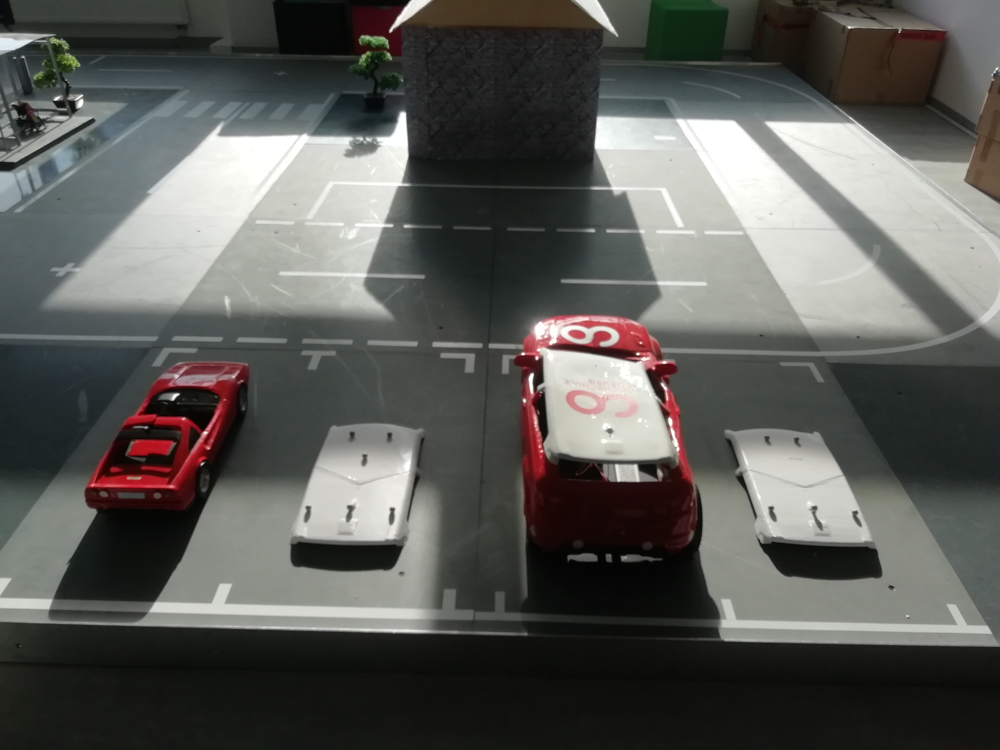
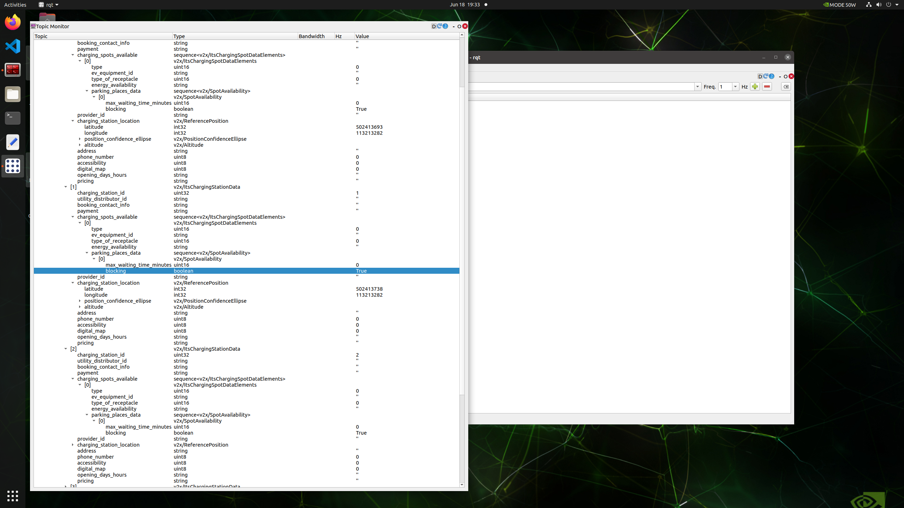
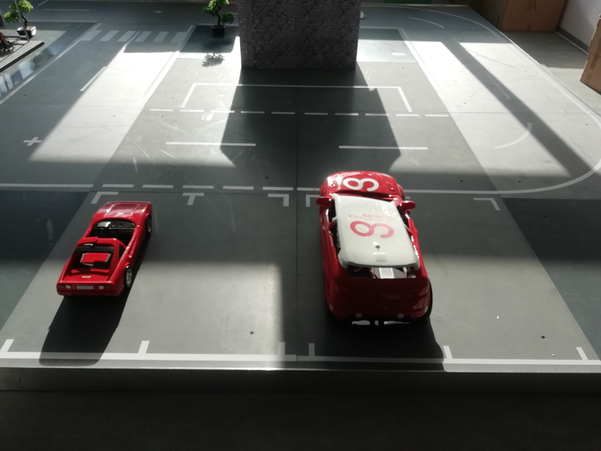
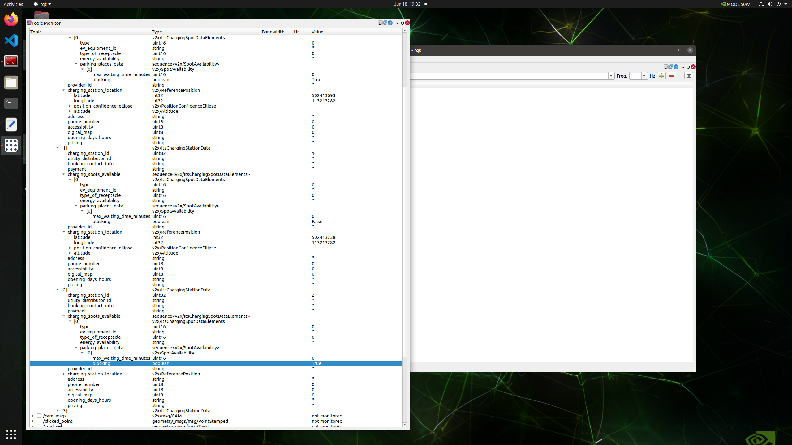

## Testcase: IT_v2x_SERVER_001

### Preparation:
1. All parking spot are empty.

    1. The v2x_server was started with command: "ros2 run sf_v2x_server v2x_server" from the terminal.
    
    2. starting rqt with the command: "rqt" from the terminal 

### Test execution
1. watch the topic /available_parking_spots in rqt
2. check the all spot
3. check the spot id is False or True (boolean value)

### Observation:
1. All the spots are availbe with False while executing the test 

### Test results
The Test is executed
Pass

## Testcase: IT_v2x_SERVER_002

### Preparation:
1. The model car is placed at 1st parking spot.

    1. The v2x_server was started with command: "ros2 run sf_v2x_server v2x_server" from the terminal.
    
    2. starting rqt with the command: "rqt" from the terminal 

### Test execution
1. watch the topic /available_parking_spots in rqt
2. check the all spot
3. check the spot id is False or True

### Observation:
1. The spot id with 0 (1st parking spot) is showing True (occupeid) and other spot id shows available with False while executing the test 

### Test results
The Test is executed :
Pass

## Testcase: IT_v2x_SERVER_003

### Preparation:
1. The cars are placed to the all parking spot.

    1. The v2x_server was started with command: "ros2 run sf_v2x_server v2x_server" from the terminal.
    
    2. starting rqt with the command: "rqt" from the terminal 

### Test execution
1. watch the topic /available_parking_spots in rqt
2. check the all spot
3. check the spot id is False or True

### Observation:
1. All parking spots id shows True means all parking spots are occupeid while executing the test 

### Test results
The Test is executed :
Pass

## Testcase: IT_v2x_SERVER_004

### Preparation:
1. The model car is placed to 1st and 3rd parking spot.

    1. The v2x_server was started with command: "ros2 run sf_v2x_server v2x_server" from the terminal.
    2. starting rqt with the command: "rqt" from the terminal 

### Test execution:
1. watch the topic /available_parking_spots in rqt
2. check the all spot
3. check the spot id is False or True

### Observation:
1. 1st and 3rd parking spot id ( 0 and 2 ) are showing True and 2nd and 4th parking spot id are showing False while executing the test
2. Get the booking request and if availble book the parking spot. 

### Test results:
The Test is executed :
Pass